# Spanish Class Portal — BPMN Process Documentation

> All diagrams use [Mermaid](https://mermaid.js.org/) flowchart notation as a BPMN approximation.
> Swimlane actors: **Student**, **Professor/Admin**, **System**, **Email Service**, **Worker (Cron)**.
>
> Open in any Mermaid-compatible renderer (VS Code Mermaid extension, mermaid.live, etc.).
>
> **Last updated:** 2026-06-28 — v8 — Session Feedback feature: new SessionFeedback model, feedback_pending notifications, student submission page, admin/professor dashboards

---

## Table of Contents

1. [Authentication & Account Flows](#1-authentication--account-flows)
   - 1.1 Registration + Email Verification
   - 1.2 Login (with 2FA Branch)
   - 1.3 Password Reset
   - 1.4 Profile Update & Logout
2. [Booking Lifecycle](#2-booking-lifecycle)
   - 2.1 Student Books a Slot (Happy Path + Waitlist)
   - 2.2 Professor Approves / Rejects
   - 2.3 Student Cancels
   - 2.4 Professor Cancels Slot
   - 2.5 Background Expiry & Reminders
3. [Slot Management (Professor)](#3-slot-management-professor)
   - 3.1 Create Single Slot
   - 3.2 Bulk / Recurring Slot Creation
   - 3.3 Direct Student Booking (Professor-Initiated)
4. [Waitlist Flow](#4-waitlist-flow)
5. [Meeting / Video Join](#5-meeting--video-join)
6. [Professor Dashboard & Analytics](#6-professor-dashboard--analytics)
7. [Student Dashboard & Profile](#7-student-dashboard--profile)
8. [Ratings & Reviews](#8-ratings--reviews)
9. [Referrals](#9-referrals)
10. [Notifications (In-App + Email)](#10-notifications-in-app--email)
11. [Admin Audit & Email Logs](#11-admin-audit--email-logs)
12. [Background Jobs](#12-background-jobs)
13. [GAP ANALYSIS](#13-gap-analysis)

---

## 1. Authentication & Account Flows

### 1.1 Registration + Email Verification

> **What this flow does**
> A new user fills in their name, email address and password on the registration page. The system checks the email isn't already taken, creates the account, and immediately sends a verification link to that email address. The user clicks the link to confirm ownership of the inbox and is automatically logged in. If the link expires before they click it (after 24 hours), they can request a fresh one.
> **Who is involved:** Student, Email Service.
> **Outcome:** A verified account with an active login session, or a clear error explaining what went wrong.

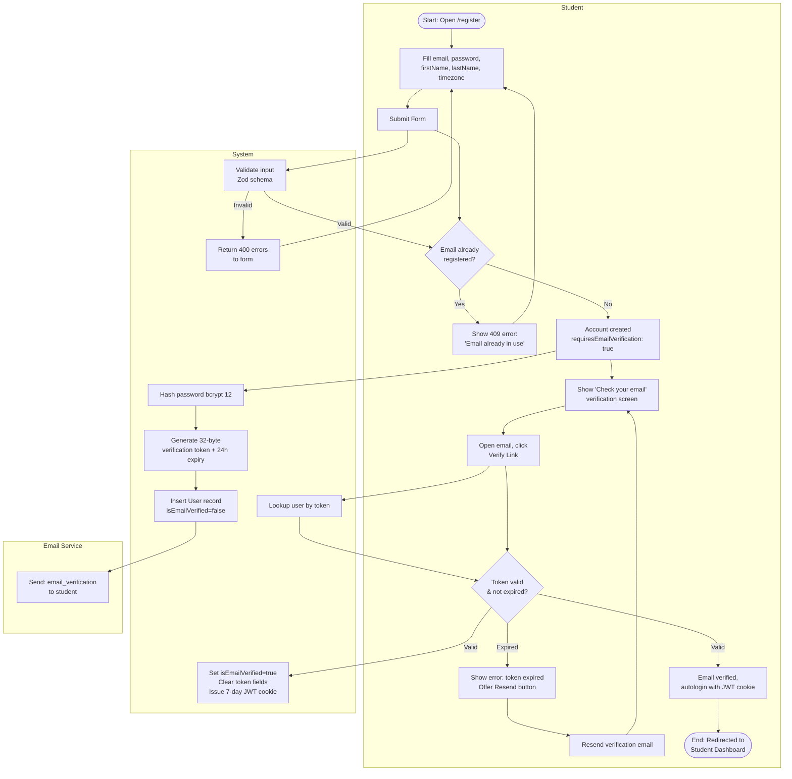
```mermaid
flowchart TD
  subgraph Student
    A([Start: Open /register]) --> B[Fill email, password,\nfirstName, lastName, timezone]
    B --> C[Submit Form]
    C --> J1{Email already\nregistered?}
    J1 -->|Yes| E1[Show 409 error:\n'Email already in use']
    E1 --> B
    J1 -->|No| D[Account created\nrequiresEmailVerification: true]
    D --> F[Show 'Check your email'\nverification screen]
    F --> G[Open email, click\nVerify Link]
    G --> H1{Token valid\n& not expired?}
    H1 -->|Expired| E2[Show error: token expired\nOffer Resend button]
    E2 --> RS[Resend verification email]
    RS --> F
    H1 -->|Valid| I[Email verified,\nautologin with JWT cookie]
    I --> Z([End: Redirected to\nStudent Dashboard])
  end

  subgraph System
    C --> V1[Validate input\nZod schema]
    V1 -->|Invalid| VE1[Return 400 errors\nto form]
    VE1 --> B
    V1 -->|Valid| J1
    D --> T1[Hash password bcrypt 12]
    T1 --> T2[Generate 32-byte\nverification token + 24h expiry]
    T2 --> T3[Insert User record\nisEmailVerified=false]
    G --> T4[Lookup user by token]
    T4 --> H1
    H1 -->|Valid| T5[Set isEmailVerified=true\nClear token fields\nIssue 7-day JWT cookie]
  end

  subgraph EmailService[Email Service]
    T3 --> EM1[Send: email_verification\nto student]
  end
```

**Gaps in this flow:**
- ❌ No validation message when password is too weak (no min-length shown inline)
- ✅ No timezone auto-detection / suggestion during registration — Already resolved (RegisterPage uses Intl.DateTimeFormat().resolvedOptions().timeZone as default)
- ❌ No resend rate limiting feedback shown to user (UI doesn't indicate cooldown)
- ✅ After successful email verification, no explicit "Welcome" email is sent — Resolved 2026-06-27 (A11: sendWelcomeEmail fires after isEmailVerified is set to true)
- ✅ Referral code not tied to registration (RF4) — Resolved 2026-06-27 (RegisterPage reads ?ref=CODE from URL, passes to backend, trackReferral called non-blocking)
- ✅ Professor invitation not tied to registration — Resolved 2026-06-27 (RegisterPage reads ?invite=TOKEN, passes to backend, acceptStudentInvitation called non-blocking)

---

### 1.2 Login (with 2FA Branch)

> **What this flow does**
> Any user (student or professor) enters their email and password. If the credentials are correct and the user is a regular student, they are immediately logged in. If the user is an administrator who has enabled two-factor authentication, they are first asked to enter a 6-digit code from their authenticator app. If they have lost access to the app, they can fall back to a one-time recovery code. After 5 failed attempts the account is temporarily locked to prevent guessing attacks.
> **Who is involved:** Student or Professor/Admin, System.
> **Outcome:** An active login session, or a clear message explaining why login failed.

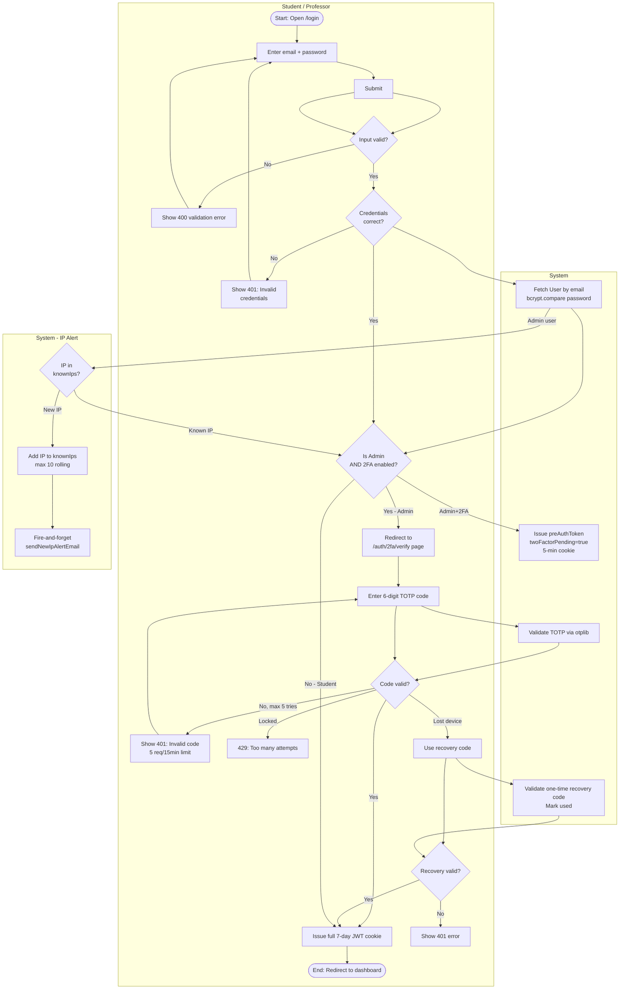
```mermaid
flowchart TD
  subgraph Student_Prof[Student / Professor]
    A([Start: Open /login]) --> B[Enter email + password]
    B --> C[Submit]
    C --> V1{Input valid?}
    V1 -->|No| E1[Show 400 validation error]
    E1 --> B
    V1 -->|Yes| J1{Credentials\ncorrect?}
    J1 -->|No| E2[Show 401: Invalid\ncredentials]
    E2 --> B
    J1 -->|Yes| J2{Is Admin\nAND 2FA enabled?}
    J2 -->|Yes - Admin| MFA[Redirect to\n/auth/2fa/verify page]
    MFA --> MFA2[Enter 6-digit TOTP code]
    MFA2 --> J3{Code valid?}
    J3 -->|No, max 5 tries| E3[Show 401: Invalid code\n5 req/15min limit]
    E3 --> MFA2
    J3 -->|Locked| E4[429: Too many attempts]
    J3 -->|Yes| FULL[Issue full 7-day JWT cookie]
    J3 -->|Lost device| REC[Use recovery code]
    REC --> J4{Recovery valid?}
    J4 -->|No| E5[Show 401 error]
    J4 -->|Yes| FULL
    J2 -->|No - Student| FULL
    FULL --> Z([End: Redirect to dashboard])
  end

  subgraph System
    C --> V1
    J1 --> SYS1[Fetch User by email\nbcrypt.compare password]
    SYS1 --> J2
    J2 -->|Admin+2FA| SYS2[Issue preAuthToken\ntwoFactorPending=true\n5-min cookie]
    MFA2 --> SYS3[Validate TOTP via otplib]
    SYS3 --> J3
    REC --> SYS4[Validate one-time recovery code\nMark used]
    SYS4 --> J4
  end

  subgraph IPCheck[System - IP Alert]
    SYS1 -->|Admin user| IP1{IP in\nknownIps?}
    IP1 -->|New IP| IP2[Add IP to knownIps\nmax 10 rolling]
    IP2 --> IP3[Fire-and-forget\nsendNewIpAlertEmail]
    IP1 -->|Known IP| J2
  end
```

**Gaps in this flow:**
- ❌ Non-admin users cannot enable 2FA (intentional design decision — admin only)
- ❌ No "remember this device for 30 days" option
- ✅ No brute-force lockout feedback displayed to user — Resolved 2026-06-27 (A13: 429 responses now surface friendly rate-limit message with retry wait time)
- ✅ Recovery codes not regenerable after use — Resolved 2026-06-27 (A5: POST /auth/2fa/regen-recovery endpoint added; requires valid TOTP to authorize)
- ✅ No email notification sent to admin when new login from unknown IP — Resolved 2026-06-27 (A7: knownIps field on User, sendNewIpAlertEmail fired on new IP for admin accounts)

---

### 1.3 Password Reset (3-step)

> **What this flow does**
> A user who has forgotten their password enters their email address. The system sends a reset link to that address (if an account exists) — the response is deliberately vague so nobody can tell whether an email is registered. The user clicks the link, enters a new password, and is logged back in automatically. The reset link expires after 1 hour and can only be used once. Admins with two-factor authentication must still complete that step after resetting their password.
> **Who is involved:** User, Email Service.
> **Outcome:** A new password is set and the user is back in their account, or an error if the link was expired or already used.

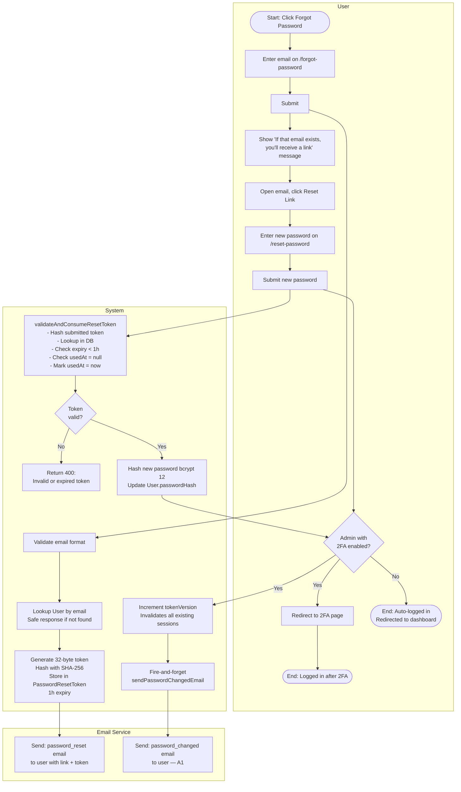
```mermaid
flowchart TD
  subgraph User
    A([Start: Click Forgot Password]) --> B[Enter email on /forgot-password]
    B --> C[Submit]
    C --> D[Show 'If that email exists,\nyou'll receive a link' message]
    D --> E[Open email, click Reset Link]
    E --> F[Enter new password on /reset-password]
    F --> G[Submit new password]
    G --> J2{Admin with\n2FA enabled?}
    J2 -->|Yes| MFA[Redirect to 2FA page]
    MFA --> Z2([End: Logged in after 2FA])
    J2 -->|No| Z([End: Auto-logged in\nRedirected to dashboard])
  end

  subgraph System
    C --> V1[Validate email format]
    V1 --> SYS1[Lookup User by email\nSafe response if not found]
    SYS1 --> SYS2[Generate 32-byte token\nHash with SHA-256\nStore in PasswordResetToken\n1h expiry]
    G --> SYS3[validateAndConsumeResetToken\n- Hash submitted token\n- Lookup in DB\n- Check expiry < 1h\n- Check usedAt = null\n- Mark usedAt = now]
    SYS3 --> J1{Token\nvalid?}
    J1 -->|No| E1[Return 400:\nInvalid or expired token]
    J1 -->|Yes| SYS4[Hash new password bcrypt 12\nUpdate User.passwordHash]
    SYS4 --> J2
    J2 -->|Yes| SYS5[Increment tokenVersion\nInvalidates all existing sessions]
    SYS5 --> SYS6[Fire-and-forget\nsendPasswordChangedEmail]
  end

  subgraph EmailService[Email Service]
    SYS2 --> EM1[Send: password_reset email\nto user with link + token]
    SYS6 --> EM2[Send: password_changed email\nto user — A1]
  end
```

**Gaps in this flow:**
- ✅ No notification email sent AFTER successful password change — Resolved 2026-06-27 (A1: sendPasswordChangedEmail fires after reset and after change-password)
- ✅ No active session invalidation on password change (existing JWT cookies remain valid) — Resolved 2026-06-27 (A2: tokenVersion incremented on password change; auth middleware rejects stale tokens)
- ❌ Password strength enforcement not communicated in UI (no strength meter)
- ✅ If user requests multiple reset emails, old tokens are not explicitly invalidated — Already resolved (createPasswordResetToken calls deleteMany before creating new token)

---

### 1.4 Profile Update & Logout

> **What this flow does**
> A logged-in user can update their display name or timezone at any time from the profile page. Changes are saved immediately and reflected across the portal. When a user clicks "Log out", their session cookie is cleared and they are returned to the login page.
> **Who is involved:** Student or Professor/Admin.
> **Outcome:** Updated profile details saved, or session ended cleanly.

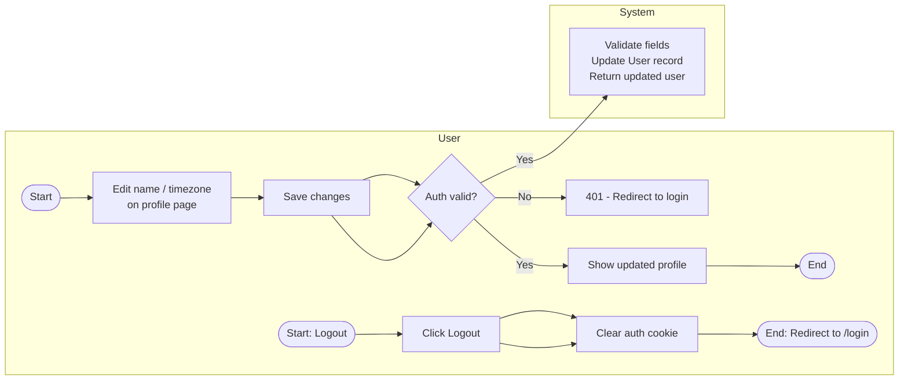
```mermaid
flowchart LR
  subgraph User
    A([Start]) --> B[Edit name / timezone\non profile page]
    B --> C[Save changes]
    C --> D{Auth valid?}
    D -->|No| E1[401 - Redirect to login]
    D -->|Yes| F[Show updated profile]
    F --> Z([End])

    G([Start: Logout]) --> H[Click Logout]
    H --> SYS[Clear auth cookie]
    SYS --> Z2([End: Redirect to /login])
  end

  subgraph System
    C --> D
    D -->|Yes| SYS2[Validate fields\nUpdate User record\nReturn updated user]
    H --> SYS
  end
```

**Gaps in this flow:**
- ✅ Logout only clears the cookie — no server-side token blacklisting — Resolved 2026-06-27 (A3: POST /auth/logout-all increments tokenVersion; auth middleware rejects stale tokens)
- ✅ No "change password" option in profile — Resolved 2026-06-27 (A2: POST /auth/change-password added; SettingsPage has Change Password card with strength meter)
- ✅ No email address change supported — Resolved 2026-06-27 (A9: POST /auth/change-email + GET /auth/verify-email-change two-step flow; SettingsPage Email Address card)
- ✅ No account deletion — Resolved 2026-06-27 (A10: POST /auth/delete-account soft-deletes via deletedAt; SettingsPage Danger Zone with DeleteAccountDialog)
- ✅ No password strength meter in UI — Resolved 2026-06-27 (A8: PasswordStrengthMeter component added to RegisterPage and Settings change-password form)

---

## 2. Booking Lifecycle

### 2.1 Student Books a Slot (Happy Path + Waitlist)

> **What this flow does**
> A student browses available class slots and clicks "Book" on one they want. The system checks that the slot is still open, that the student hasn't already booked it, and that it hasn't started yet. If everything is fine, a pending booking is created and both the student and professor receive an email — the professor gets a request to confirm or reject, and the student is told their booking is awaiting approval. If the class is a group session that is already full, the student is automatically added to the waitlist and told their position. The system uses a concurrency lock so two students clicking "Book" at exactly the same moment cannot both overbook the last spot.
> **Who is involved:** Student, System, Email Service, Notification Service.
> **Outcome:** A pending booking awaiting professor approval, or a waitlist position, or a clear error (slot gone, already booked, etc.).

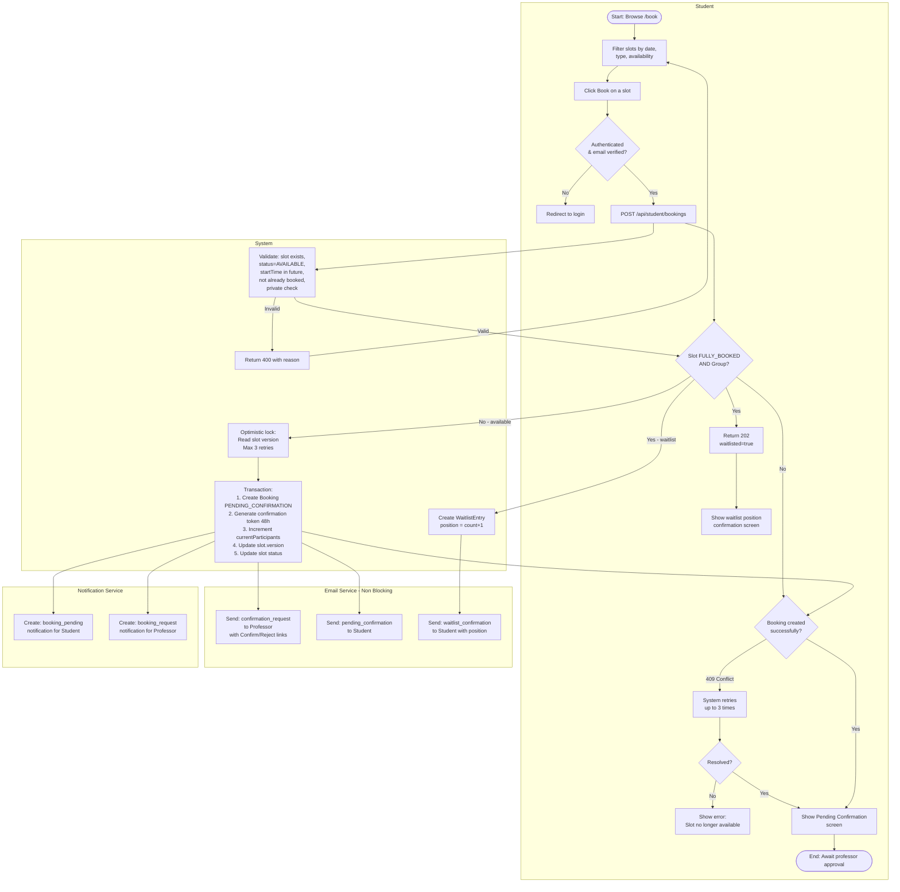
```mermaid
flowchart TD
  subgraph Student
    A([Start: Browse /book]) --> B[Filter slots by date,\ntype, availability]
    B --> C[Click Book on a slot]
    C --> AUTH{Authenticated\n& email verified?}
    AUTH -->|No| E0[Redirect to login]
    AUTH -->|Yes| REQ[POST /api/student/bookings]
    REQ --> J_FULL{Slot FULLY_BOOKED\nAND Group?}
    J_FULL -->|Yes| WL[Return 202\nwaitlisted=true]
    WL --> WLE[Show waitlist position\nconfirmation screen]
    J_FULL -->|No| J_OK{Booking created\nsuccessfully?}
    J_OK -->|409 Conflict| RETRY[System retries\nup to 3 times]
    RETRY --> J_OK2{Resolved?}
    J_OK2 -->|No| E1[Show error:\nSlot no longer available]
    J_OK2 -->|Yes| PEND
    J_OK -->|Yes| PEND[Show Pending Confirmation\nscreen]
    PEND --> Z([End: Await professor approval])
  end

  subgraph System
    REQ --> V1[Validate: slot exists,\nstatus=AVAILABLE,\nstartTime in future,\nnot already booked,\nprivate check]
    V1 -->|Invalid| E2[Return 400 with reason]
    E2 --> B
    V1 -->|Valid| J_FULL
    J_FULL -->|No - available| LOCK[Optimistic lock:\nRead slot version\nMax 3 retries]
    LOCK --> TXN[Transaction:\n1. Create Booking PENDING_CONFIRMATION\n2. Generate confirmation token 48h\n3. Increment currentParticipants\n4. Update slot.version\n5. Update slot status]
    TXN --> J_OK
    J_FULL -->|Yes - waitlist| WL_SYS[Create WaitlistEntry\nposition = count+1]
  end

  subgraph EmailService[Email Service - Non Blocking]
    TXN --> EM1[Send: confirmation_request\nto Professor\nwith Confirm/Reject links]
    TXN --> EM2[Send: pending_confirmation\nto Student]
    WL_SYS --> EM3[Send: waitlist_confirmation\nto Student with position]
  end

  subgraph NotifService[Notification Service]
    TXN --> N1[Create: booking_pending\nnotification for Student]
    TXN --> N2[Create: booking_request\nnotification for Professor]
  end
```

**Gaps in this flow:**
- ❌ No visible countdown timer for the 48-hour confirmation window shown to student
- ❌ Student cannot see who else is in a GROUP class before booking
- ❌ No pre-booking check: student's email must be verified (this IS enforced but the error message is unclear)
- ❌ If the same student tries to re-book after REJECTED, there's no explicit re-booking path

---

### 2.2 Professor Approves / Rejects

> **What this flow does**
> After a student books a class, the professor receives an email with two buttons: "Confirm" and "Reject". Clicking either button instantly updates the booking — no login required. The professor can also handle pending bookings from their dashboard, where they can see a queue of requests and optionally add a rejection reason. Once confirmed, the student receives a calendar invite and a meeting link. Once rejected, the student is told why (if a reason was given) and can book another slot. The confirmation window is open for 48 hours; a reminder is sent to the professor if they haven't acted with less than 6 hours remaining.
> **Who is involved:** Professor/Admin, Student (receives result), Email Service, Notification Service.
> **Outcome:** Booking is confirmed (student gets calendar invite) or rejected (student is notified with optional reason).

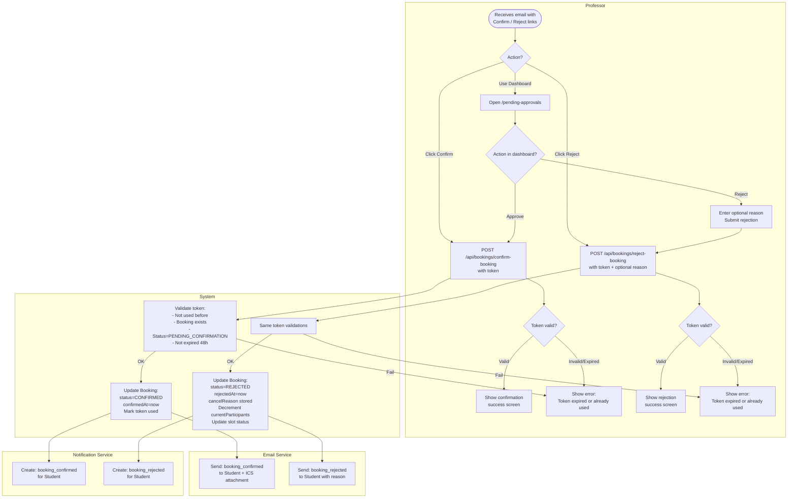
```mermaid
flowchart TD
  subgraph Professor
    A([Receives email with\nConfirm / Reject links]) --> J1{Action?}
    J1 -->|Click Confirm| CONF[POST /api/bookings/confirm-booking\nwith token]
    J1 -->|Click Reject| REJ[POST /api/bookings/reject-booking\nwith token + optional reason]
    J1 -->|Use Dashboard| DASH[Open /pending-approvals]
    DASH --> J2{Action in dashboard?}
    J2 -->|Approve| CONF
    J2 -->|Reject| REJ_D[Enter optional reason\nSubmit rejection]
    REJ_D --> REJ

    CONF --> J3{Token valid?}
    J3 -->|Valid| CONF_OK[Show confirmation\nsuccess screen]
    J3 -->|Invalid/Expired| E1[Show error:\nToken expired or already used]
    REJ --> J4{Token valid?}
    J4 -->|Valid| REJ_OK[Show rejection\nsuccess screen]
    J4 -->|Invalid/Expired| E2[Show error:\nToken expired or already used]
  end

  subgraph System
    CONF --> SYS1[Validate token:\n- Not used before\n- Booking exists\n- Status=PENDING_CONFIRMATION\n- Not expired 48h]
    SYS1 -->|OK| SYS2[Update Booking:\nstatus=CONFIRMED\nconfirmedAt=now\nMark token used]
    SYS1 -->|Fail| E1
    REJ --> SYS3[Same token validations]
    SYS3 -->|OK| SYS4[Update Booking:\nstatus=REJECTED\nrejectedAt=now\ncancelReason stored\nDecrement currentParticipants\nUpdate slot status]
    SYS3 -->|Fail| E2
  end

  subgraph EmailService[Email Service]
    SYS2 --> EM1[Send: booking_confirmed\nto Student + ICS attachment]
    SYS4 --> EM2[Send: booking_rejected\nto Student with reason]
  end

  subgraph NotifService[Notification Service]
    SYS2 --> N1[Create: booking_confirmed\nfor Student]
    SYS4 --> N2[Create: booking_rejected\nfor Student]
  end
```

**Gaps in this flow:**
- ❌ Professor cannot add a message/note when CONFIRMING (only when rejecting) — intentional product decision (B7 skipped)
- ❌ Professor cannot partially confirm (e.g., reschedule) — only binary approve/reject (B8 skipped — too complex)
- ✅ If professor ignores, booking expires silently — student receives NO explicit "expired" notification email — Resolved 2026-06-27 (B1: sendBookingExpiredToStudent fires from expirePendingBookings job)
- ❌ No confirmation page/feedback when approving via email link (just success/failure message)
- ❌ Token confirmation page (/booking/confirm?token=...) accessible while logged out — no auth required (intentional but note for security)

---

### 2.3 Student Cancels Booking

> **What this flow does**
> A student can cancel a confirmed booking from their bookings list. The professor sets a cancellation window (defaulting to 24 hours before the class starts) — if the class is too soon, the cancellation is blocked and the student is told when the deadline was. If the cancellation is allowed, the slot is freed up and both the student and the professor receive a notification. If other students were waiting on the waitlist for that slot, the first one in line is automatically moved up and given a new pending booking (which the professor still needs to approve).
> **Who is involved:** Student, System, Email Service.
> **Outcome:** Booking cancelled and slot freed; waitlisted students promoted automatically.

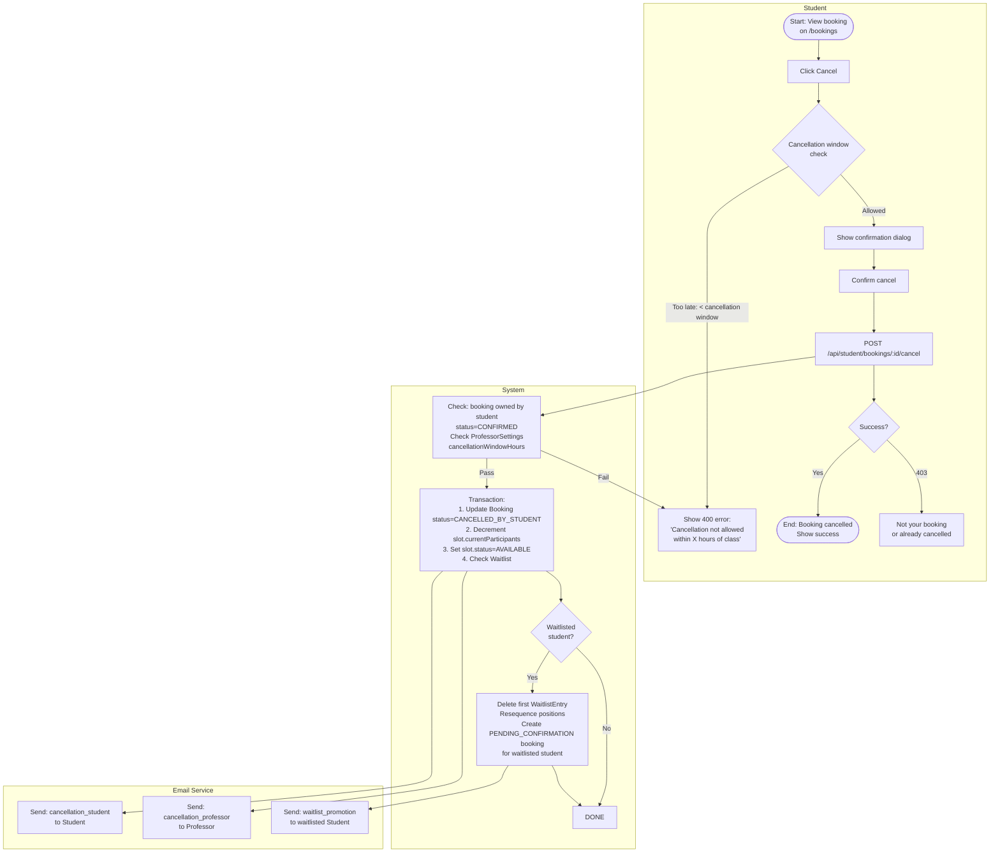
```mermaid
flowchart TD
  subgraph Student
    A([Start: View booking\non /bookings]) --> B[Click Cancel]
    B --> J1{Cancellation window\ncheck}
    J1 -->|Too late: < cancellation window| E1[Show 400 error:\n'Cancellation not allowed\nwithin X hours of class']
    J1 -->|Allowed| CONF[Show confirmation dialog]
    CONF --> C[Confirm cancel]
    C --> SYS[POST /api/student/bookings/:id/cancel]
    SYS --> J2{Success?}
    J2 -->|Yes| Z([End: Booking cancelled\nShow success])
    J2 -->|403| E2[Not your booking\nor already cancelled]
  end

  subgraph System
    SYS --> V1[Check: booking owned by student\nstatus=CONFIRMED\nCheck ProfessorSettings\ncancellationWindowHours]
    V1 -->|Fail| E1
    V1 -->|Pass| TXN[Transaction:\n1. Update Booking status=CANCELLED_BY_STUDENT\n2. Decrement slot.currentParticipants\n3. Set slot.status=AVAILABLE\n4. Check Waitlist]
    TXN --> WL{Waitlisted\nstudent?}
    WL -->|Yes| WL2[Delete first WaitlistEntry\nResequence positions\nCreate PENDING_CONFIRMATION booking\nfor waitlisted student]
    WL -->|No| DONE
    WL2 --> DONE
  end

  subgraph EmailService[Email Service]
    TXN --> EM1[Send: cancellation_student\nto Student]
    TXN --> EM2[Send: cancellation_professor\nto Professor]
    WL2 --> EM3[Send: waitlist_promotion\nto waitlisted Student]
  end
```

**Gaps in this flow:**
- ❌ No optional cancellation reason input from student
- ❌ If student cancels a GROUP class with waitlisted student, waitlisted student still needs professor approval — UX not clearly communicated
- ❌ Admin bypass of cancellation window not surfaced in UI (admin can cancel any time but students cannot)
- ❌ No undo / "restore booking" path after accidental cancellation

---

### 2.4 Professor Cancels Slot (with Bookings)

> **What this flow does**
> Sometimes a professor needs to cancel a class that already has students booked in. If the slot has no bookings, it can simply be deleted. If there are confirmed or pending bookings, the professor uses a special "cancel with bookings" action that simultaneously cancels the slot and every booking attached to it. Each affected student receives a cancellation email with an optional reason from the professor. For slots with no bookings, a regular delete is enough.
> **Who is involved:** Professor/Admin, System, Email Service, Notification Service.
> **Outcome:** Slot marked cancelled; all affected students notified.

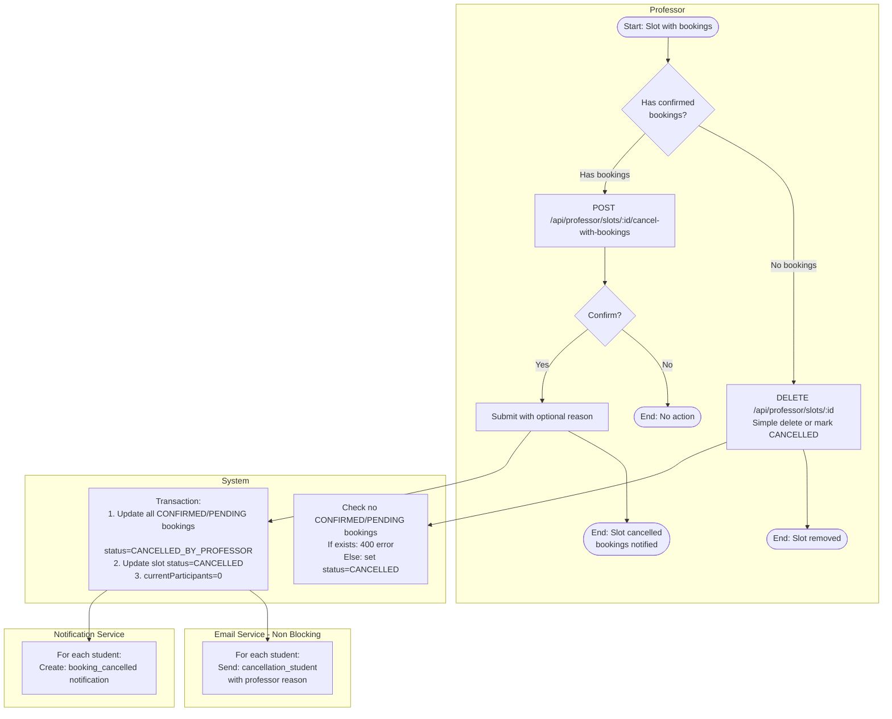
```mermaid
flowchart TD
  subgraph Professor
    A([Start: Slot with bookings]) --> B{Has confirmed\nbookings?}
    B -->|No bookings| DEL[DELETE /api/professor/slots/:id\nSimple delete or mark CANCELLED]
    B -->|Has bookings| CANCEL[POST /api/professor/slots/:id/cancel-with-bookings]
    CANCEL --> J1{Confirm?}
    J1 -->|No| END1([End: No action])
    J1 -->|Yes| SYS[Submit with optional reason]
    DEL --> Z([End: Slot removed])
    SYS --> Z2([End: Slot cancelled\nbookings notified])
  end

  subgraph System
    SYS --> TXN[Transaction:\n1. Update all CONFIRMED/PENDING bookings\n   status=CANCELLED_BY_PROFESSOR\n2. Update slot status=CANCELLED\n3. currentParticipants=0]
    DEL --> SYS2[Check no CONFIRMED/PENDING bookings\nIf exists: 400 error\nElse: set status=CANCELLED]
  end

  subgraph EmailService[Email Service - Non Blocking]
    TXN --> EM1[For each student:\nSend: cancellation_student\nwith professor reason]
  end

  subgraph NotifService[Notification Service]
    TXN --> N1[For each student:\nCreate: booking_cancelled notification]
  end
```

**Gaps in this flow:**
- ❌ No mandatory reason required when professor cancels (reason is optional, but students deserve context)
- ❌ No compensation / rescheduling offer sent in cancellation email
- ❌ No audit trail surfaced to student when professor cancels excessively
- ❌ Waitlisted students for a cancelled slot are NOT automatically removed from waitlist — they remain waiting for a slot that's now CANCELLED

---

### 2.5 Background Expiry & Reminders (Cron Jobs)

> **What this flow does**
> Two automated tasks run every hour behind the scenes. The first looks for booking requests that the professor never responded to and marks them as expired once the 48-hour window has passed. The second finds requests that are about to expire (less than 6 hours left) and sends the professor a reminder email if one hasn't been sent yet. Both tasks run silently — no user action is needed to trigger them.
> **Who is involved:** Worker (Cron), Email Service.
> **Outcome:** Stale pending bookings are cleaned up automatically; professors get a last-chance reminder before a booking expires.

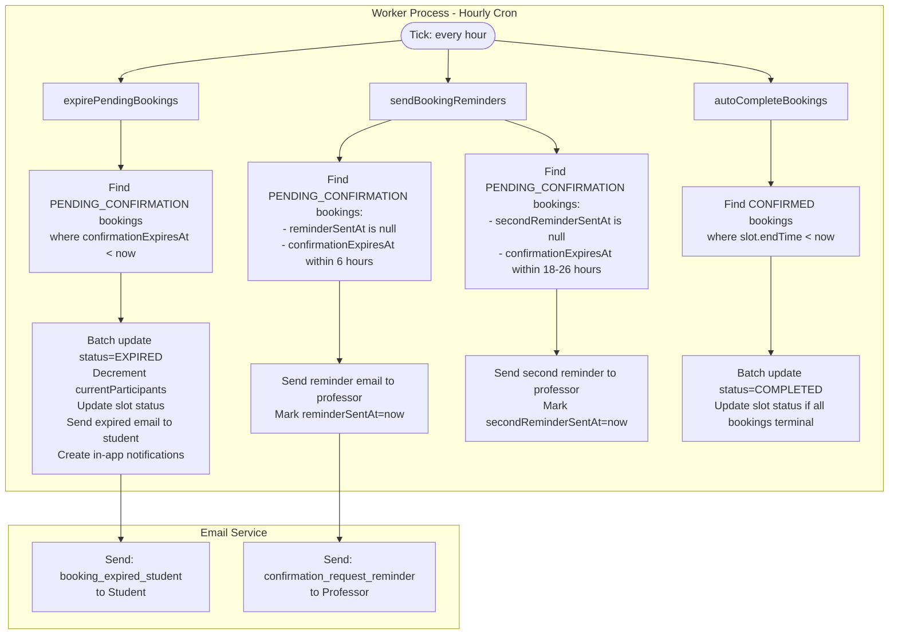
```mermaid
flowchart TD
  subgraph Worker[Worker Process - Hourly Cron]
    A([Tick: every hour]) --> J1[expirePendingBookings]
    A --> J2[sendBookingReminders]
    A --> J3[autoCompleteBookings]

    J1 --> SYS1[Find PENDING_CONFIRMATION bookings\nwhere confirmationExpiresAt < now]
    SYS1 --> SYS2[Batch update status=EXPIRED\nDecrement currentParticipants\nUpdate slot status\nSend expired email to student\nCreate in-app notifications]

    J2 --> SYS3[Find PENDING_CONFIRMATION bookings:\n- reminderSentAt is null\n- confirmationExpiresAt within 6 hours]
    SYS3 --> SYS4[Send reminder email to professor\nMark reminderSentAt=now]
    J2 --> SYS5[Find PENDING_CONFIRMATION bookings:\n- secondReminderSentAt is null\n- confirmationExpiresAt within 18-26 hours]
    SYS5 --> SYS6[Send second reminder to professor\nMark secondReminderSentAt=now]

    J3 --> SYS7[Find CONFIRMED bookings\nwhere slot.endTime < now]
    SYS7 --> SYS8[Batch update status=COMPLETED\nUpdate slot status if all bookings terminal]
  end

  subgraph EmailService[Email Service]
    SYS4 --> EM1[Send: confirmation_request_reminder\nto Professor]
    SYS2 --> EM2[Send: booking_expired_student\nto Student]
  end
```

**Gaps in this flow:**
- ✅ When booking expires, NO notification is sent to student — Resolved 2026-06-27 (B1: sendBookingExpiredToStudent + in-app notification)
- ✅ When booking expires, NO notification is sent to professor — Resolved 2026-06-27 (B2: in-app notification `booking_expired_professor` created for professor)
- ✅ Only one reminder is sent to professor — Resolved 2026-06-27 (B4: second reminder sent at 18–26h before expiry using `secondReminderSentAt` field)
- ✅ Expired bookings do NOT automatically reopen the slot to other students — Resolved 2026-06-27 (B3: `currentParticipants` decremented and slot status updated on expiry)
- ✅ Slot's `currentParticipants` is NOT decremented on expiry — Resolved 2026-06-27 (B3: decremented in expirePendingBookings job and applyRejectionSideEffects service)

---

## 3. Slot Management (Professor)

### 3.1 Create Single Slot

> **What this flow does**
> A professor creates a single class slot by choosing a date, start and end time, class type (individual or group), and an optional title and description. They can also mark the slot as private and restrict it to specific students, or directly book a chosen student into it without needing approval. The system checks there are no time overlaps with the professor's other slots and automatically creates a video meeting room for the class.
> **Who is involved:** Professor/Admin, System, Email Service.
> **Outcome:** A new class slot is published and visible to students (or to specific invited students if private).

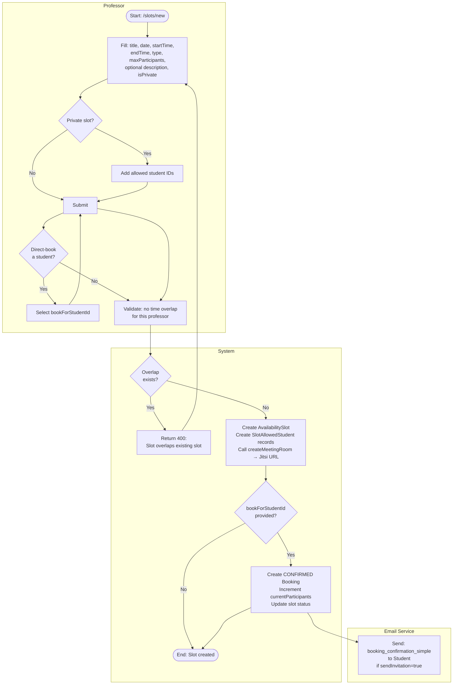
```mermaid
flowchart TD
  subgraph Professor
    A([Start: /slots/new]) --> B[Fill: title, date, startTime,\nendTime, type, maxParticipants,\noptional description, isPrivate]
    B --> J1{Private slot?}
    J1 -->|Yes| B2[Add allowed student IDs]
    J1 -->|No| C
    B2 --> C[Submit]
    C --> J2{Direct-book\na student?}
    J2 -->|Yes| B3[Select bookForStudentId]
    B3 --> C
    J2 -->|No| SYS
  end

  subgraph System
    C --> SYS[Validate: no time overlap\nfor this professor]
    SYS --> J3{Overlap\nexists?}
    J3 -->|Yes| E1[Return 400:\nSlot overlaps existing slot]
    E1 --> B
    J3 -->|No| SYS2[Create AvailabilitySlot\nCreate SlotAllowedStudent records\nCall createMeetingRoom → Jitsi URL]
    SYS2 --> J4{bookForStudentId\nprovided?}
    J4 -->|Yes| SYS3[Create CONFIRMED Booking\nIncrement currentParticipants\nUpdate slot status]
    J4 -->|No| DONE([End: Slot created])
    SYS3 --> DONE
  end

  subgraph EmailService[Email Service]
    SYS3 --> EM1[Send: booking_confirmation_simple\nto Student\nif sendInvitation=true]
  end
```

**Gaps in this flow:**
- ❌ No conflict check across recurring patterns (only checks existing concrete slots)
- ❌ No duration validation (e.g., max slot length or minimum 30 min)
- ❌ No timezone display/conversion — professor sees times in their timezone; students may see wrong time if timezones differ

---

### 3.2 Bulk / Recurring Slot Creation

> **What this flow does**
> Instead of creating slots one by one, a professor can create many at once. The bulk tool lets them pick a date range, select which days of the week to include, set a time, and generate all matching slots in one go. The recurring pattern tool goes further — it saves a repeating schedule (e.g. "every Monday and Wednesday at 10:00") so that slots are generated automatically for that period. Any time that would clash with an existing slot is skipped.
> **Who is involved:** Professor/Admin, System.
> **Outcome:** Multiple class slots created in one action, covering the selected dates and times.

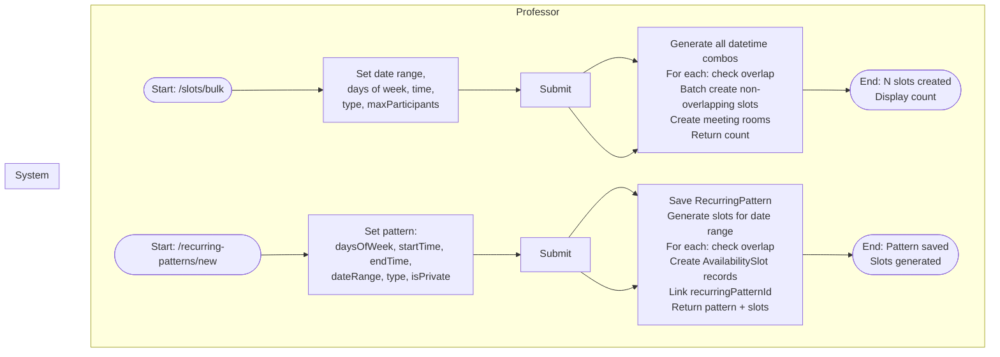
```mermaid
flowchart TD
  subgraph Professor
    A([Start: /slots/bulk]) --> B[Set date range,\ndays of week, time,\ntype, maxParticipants]
    B --> C[Submit]
    C --> SYS
    SYS --> DONE([End: N slots created\nDisplay count])

    A2([Start: /recurring-patterns/new]) --> B2[Set pattern:\ndaysOfWeek, startTime, endTime,\ndateRange, type, isPrivate]
    B2 --> C2[Submit]
    C2 --> SYS2
    SYS2 --> DONE2([End: Pattern saved\nSlots generated])
  end

  subgraph System
    C --> SYS[Generate all datetime combos\nFor each: check overlap\nBatch create non-overlapping slots\nCreate meeting rooms\nReturn count]

    C2 --> SYS2[Save RecurringPattern\nGenerate slots for date range\nFor each: check overlap\nCreate AvailabilitySlot records\nLink recurringPatternId\nReturn pattern + slots]
  end
```

**Gaps in this flow:**
- ❌ Overlapping slots in bulk creation are silently skipped — no clear report to professor which were skipped
- ❌ No way to edit all slots in a recurring pattern at once (only individual slots via PUT)
- ❌ No deletion of an entire recurring pattern + its future slots in one action

---

### 3.3 Direct Student Booking (Professor-Initiated)

> **What this flow does**
> A professor can book a student into one of their own slots directly, without going through the usual approval process. This is useful for confirming arrangements made outside the platform (e.g. via message or phone). The booking is immediately marked as confirmed. The professor can optionally choose to send the student an invitation email with the meeting details; if they don't, the student receives no notification at all.
> **Who is involved:** Professor/Admin, System, Email Service.
> **Outcome:** Student is instantly confirmed into the class, with or without an email notification.

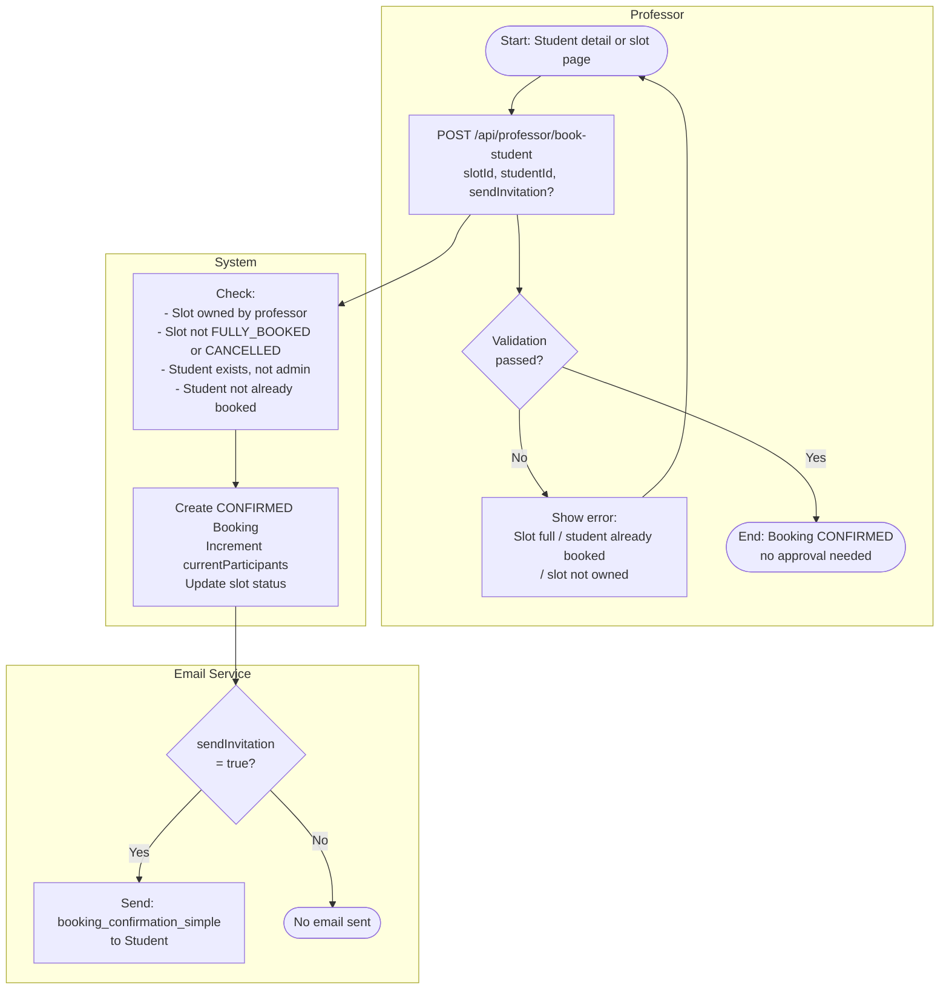
```mermaid
flowchart TD
  subgraph Professor
    A([Start: Student detail or slot page]) --> B[POST /api/professor/book-student\nslotId, studentId, sendInvitation?]
    B --> J1{Validation\npassed?}
    J1 -->|No| E1[Show error:\nSlot full / student already booked\n/ slot not owned]
    E1 --> A
    J1 -->|Yes| DONE([End: Booking CONFIRMED\nno approval needed])
  end

  subgraph System
    B --> V1[Check:\n- Slot owned by professor\n- Slot not FULLY_BOOKED or CANCELLED\n- Student exists, not admin\n- Student not already booked]
    V1 --> SYS1[Create CONFIRMED Booking\nIncrement currentParticipants\nUpdate slot status]
  end

  subgraph EmailService[Email Service]
    SYS1 --> J2{sendInvitation\n= true?}
    J2 -->|Yes| EM1[Send: booking_confirmation_simple\nto Student]
    J2 -->|No| SKIP([No email sent])
  end
```

**Gaps in this flow:**
- ❌ Default is `sendInvitation: false` — easy to forget to notify student
- ❌ No in-app notification is created for the student when professor directly books them
- ❌ Student has no way to decline a professor-initiated direct booking

---

## 4. Waitlist Flow

> **What this flow does**
> When a student tries to book a group class that is already full, they are automatically placed on a waitlist and told their position (e.g. "You are #2 in line"). If a confirmed student later cancels, the first person on the waitlist is automatically moved up — they get an email saying a spot opened, and a new pending booking is created that the professor still needs to approve. A student can also leave the waitlist at any time, which shifts everyone behind them up by one position.
> **Who is involved:** Student, System, Email Service.
> **Outcome:** Student is queued for the next available spot and promoted automatically when one opens.

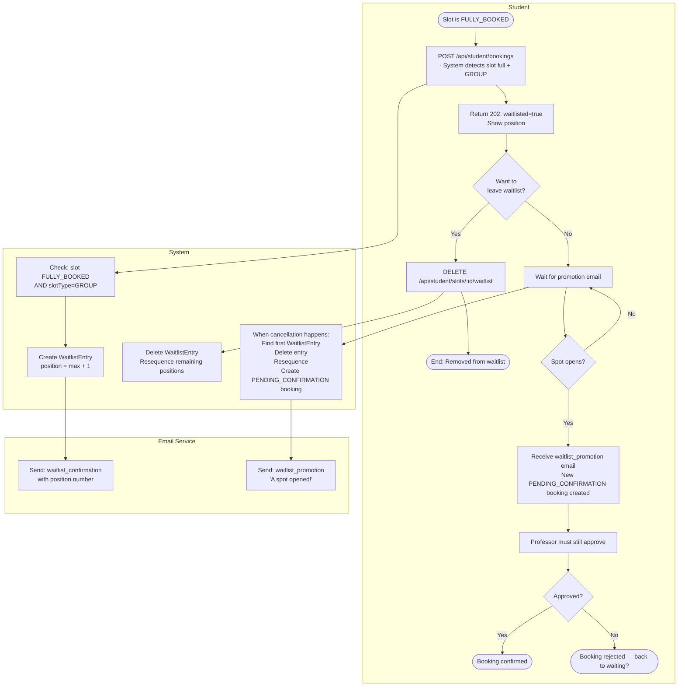
```mermaid
flowchart TD
  subgraph Student
    A([Slot is FULLY_BOOKED]) --> B[POST /api/student/bookings\n- System detects slot full + GROUP]
    B --> WL[Return 202: waitlisted=true\nShow position]
    WL --> C{Want to\nleave waitlist?}
    C -->|Yes| DEL[DELETE /api/student/slots/:id/waitlist]
    DEL --> Z([End: Removed from waitlist])
    C -->|No| WAIT[Wait for promotion email]
    WAIT --> J1{Spot opens?}
    J1 -->|No| WAIT
    J1 -->|Yes| PROMOTED[Receive waitlist_promotion email\nNew PENDING_CONFIRMATION booking created]
    PROMOTED --> PROF[Professor must still approve]
    PROF --> J2{Approved?}
    J2 -->|Yes| CONF([Booking confirmed])
    J2 -->|No| REJ([Booking rejected — back to waiting?])
  end

  subgraph System
    B --> SYS1[Check: slot FULLY_BOOKED\nAND slotType=GROUP]
    SYS1 --> SYS2[Create WaitlistEntry\nposition = max + 1]
    DEL --> SYS3[Delete WaitlistEntry\nResequence remaining positions]
    WAIT --> SYS4[When cancellation happens:\nFind first WaitlistEntry\nDelete entry\nResequence\nCreate PENDING_CONFIRMATION booking]
  end

  subgraph EmailService[Email Service]
    SYS2 --> EM1[Send: waitlist_confirmation\nwith position number]
    SYS4 --> EM2[Send: waitlist_promotion\n'A spot opened!']
  end
```

**Gaps in this flow:**
- ❌ After promotion and rejection by professor, student is NOT automatically re-added to waitlist
- ❌ Waitlist does NOT work for INDIVIDUAL slots (intentional?) — not documented in UI
- ❌ No waitlist position update emails when others leave the waitlist
- ❌ No expiry on waitlist entries — student could be waitlisted forever on a past-date slot
- ❌ Waitlist entries NOT cleaned up when slot is CANCELLED by professor

---

## 5. Meeting / Video Join

> **What this flow does**
> When it's time for a class, both the student and the professor can click "Join Meeting" from their respective dashboards. The system checks that the booking is confirmed and the slot hasn't been cancelled, then opens the class video room (hosted on Jitsi) in a new browser tab. No account is needed on the video platform — the link is enough to enter the room.
> **Who is involved:** Student, Professor/Admin, System.
> **Outcome:** Both participants land in the same video room and the class can begin.

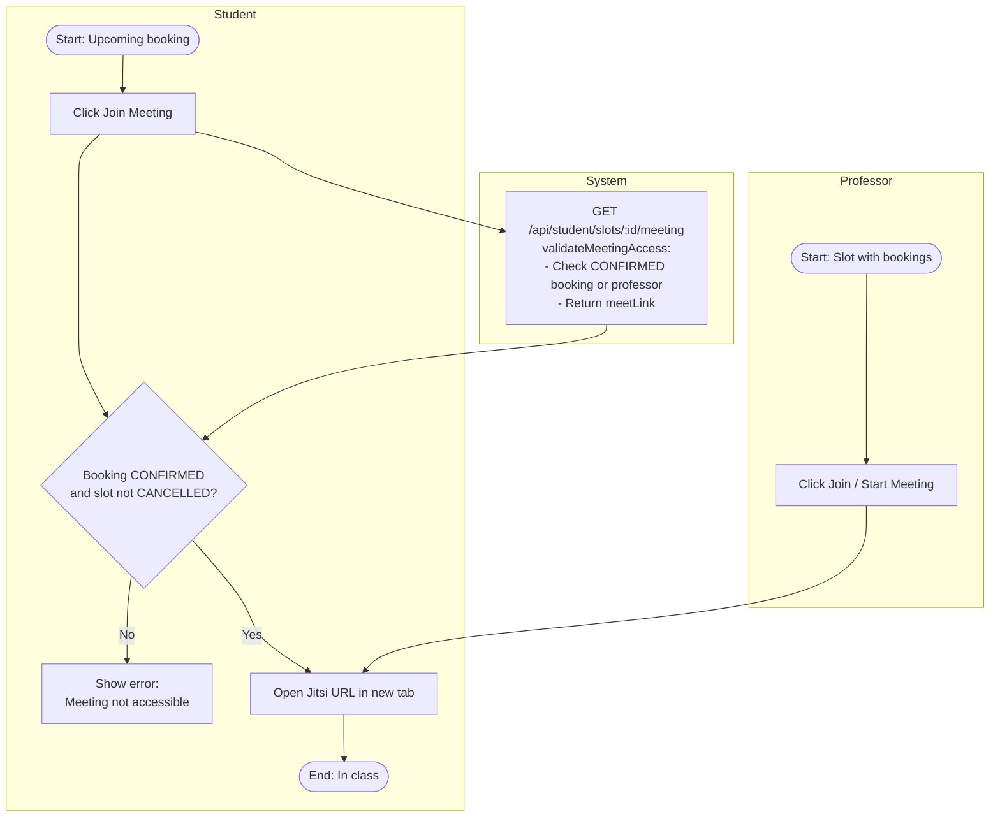
```mermaid
flowchart TD
  subgraph Student
    A([Start: Upcoming booking]) --> B[Click Join Meeting]
    B --> AUTH{Booking CONFIRMED\nand slot not CANCELLED?}
    AUTH -->|No| E1[Show error:\nMeeting not accessible]
    AUTH -->|Yes| JITSI[Open Jitsi URL in new tab]
    JITSI --> Z([End: In class])
  end

  subgraph Professor
    A2([Start: Slot with bookings]) --> B2[Click Join / Start Meeting]
    B2 --> JITSI
  end

  subgraph System
    B --> SYS1[GET /api/student/slots/:id/meeting\nvalidateMeetingAccess:\n- Check CONFIRMED booking or professor\n- Return meetLink]
    SYS1 --> AUTH
  end
```

**Gaps in this flow:**
- ❌ No check if the meeting time is "now" (student could join days before or after)
- ❌ No "waiting room" or host-must-start concept — Jitsi room is always open
- ❌ No recording management (start/stop recording, storage)
- ❌ Meeting notes exist in DB (MeetingNote model) but no UI exists to fill them
- ❌ No post-class "rate this session" prompt shown immediately after meeting ends

---

## 6. Professor Dashboard & Analytics

> **What this flow does**
> The professor's dashboard gives an at-a-glance summary of teaching activity. The analytics section shows completed classes, earnings, student retention, and average ratings for a chosen date range. Stats are pre-aggregated nightly so the dashboard loads instantly. The professor can export earnings as a CSV file for tax or accounting purposes.
> **Who is involved:** Professor/Admin, System, Worker (Cron).
> **Outcome:** Professor has real-time visibility into performance metrics and can export earnings data.

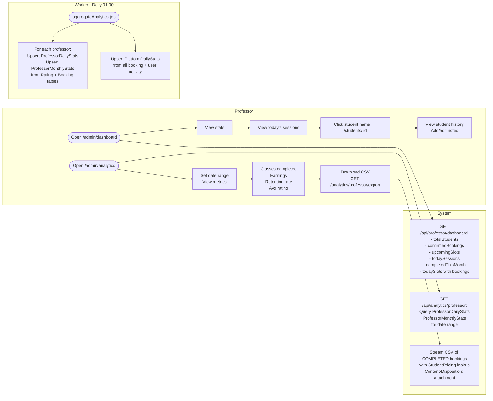
```mermaid
flowchart LR
  subgraph Professor
    A([Open /admin/dashboard]) --> B[View stats]
    B --> C[View today's sessions]
    C --> D[Click student name → /students/:id]
    D --> E[View student history\nAdd/edit notes]

    A2([Open /admin/analytics]) --> F[Set date range\nView metrics]
    F --> G[Classes completed\nEarnings\nRetention rate\nAvg rating]
    G --> EXP[Download CSV\nGET /analytics/professor/export]
  end

  subgraph System
    A --> SYS1[GET /api/professor/dashboard:\n- totalStudents\n- confirmedBookings\n- upcomingSlots\n- todaySessions\n- completedThisMonth\n- todaySlots with bookings]
    A2 --> SYS2[GET /api/analytics/professor:\nQuery ProfessorDailyStats\nProfessorMonthlyStats\nfor date range]
    EXP --> SYS3[Stream CSV of COMPLETED bookings\nwith StudentPricing lookup\nContent-Disposition: attachment]
  end

  subgraph Worker[Worker - Daily 01:00]
    W1([aggregateAnalytics job]) --> W2[For each professor:\nUpsert ProfessorDailyStats\nUpsert ProfessorMonthlyStats\nfrom Rating + Booking tables]
    W1 --> W3[Upsert PlatformDailyStats\nfrom all booking + user activity]
  end
```

**Gaps in this flow:**
- ✅ Analytics stats (ProfessorDailyStats, MonthlyStats) have no visible update mechanism — Resolved 2026-06-27 (J2: aggregateAnalytics job runs daily at 01:00, computes from Rating + Booking tables; AN1 resolved)
- ✅ No completion marking flow (how does a CONFIRMED booking become COMPLETED?) — Resolved 2026-06-27 (B10: autoCompleteBookings job; AN3 resolved)
- ✅ No earnings export (CSV/PDF) — Resolved 2026-06-28 (AN4: GET /api/analytics/professor/export returns CSV; date-range picker + Export CSV button in dashboard)
- ✅ Rating/review data not flowing into analytics aggregates — Resolved 2026-06-28 (AN5: aggregateAnalytics queries Rating table for averageRating in daily/monthly stats; StudentEngagementStats.averageRatingGiven updated via ratings service)
- ❌ No calendar view-based booking management (slots view exists but not a drag-to-reschedule calendar)

---

## 7. Student Dashboard & Profile

> **What this flow does**
> After logging in, a student sees a summary of their upcoming classes, how many sessions they have completed, and what their next class is. If their profile is not fully filled in, a prompt encourages them to complete it. On the profile page they can add details like their Spanish level, learning goals, phone number, and availability notes. These details help the professor understand the student better and may be used in the future to suggest suitable classes.
> **Who is involved:** Student, System.
> **Outcome:** Student has a personalised dashboard and a complete profile the professor can refer to.

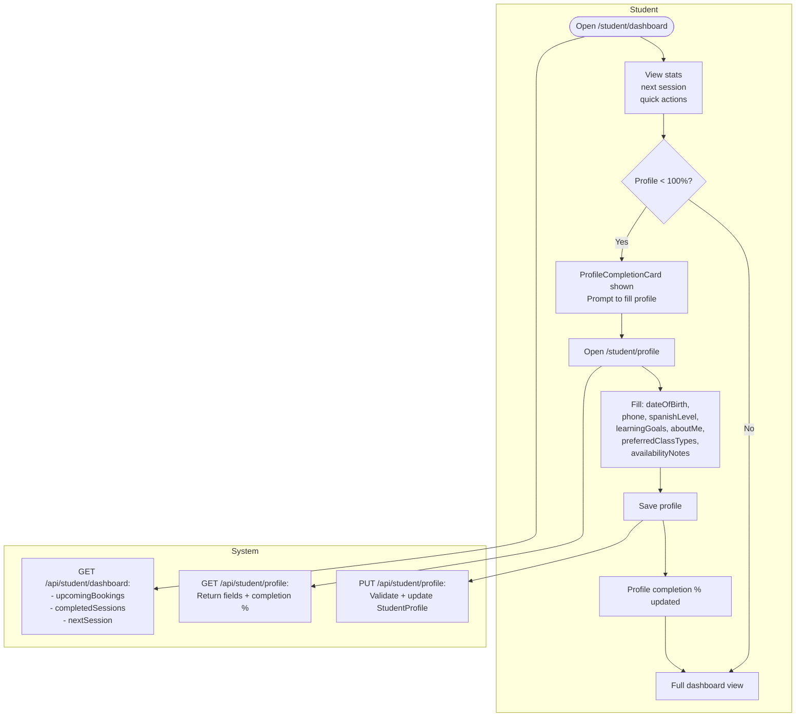
```mermaid
flowchart TD
  subgraph Student
    A([Open /student/dashboard]) --> B[View stats\nnext session\nquick actions]
    B --> J1{Profile < 100%?}
    J1 -->|Yes| C[ProfileCompletionCard shown\nPrompt to fill profile]
    J1 -->|No| D[Full dashboard view]
    C --> PROF[Open /student/profile]
    PROF --> E[Fill: dateOfBirth,\nphone, spanishLevel,\nlearningGoals, aboutMe,\npreferredClassTypes,\navailabilityNotes]
    E --> F[Save profile]
    F --> G[Profile completion % updated]
    G --> D
  end

  subgraph System
    A --> SYS1[GET /api/student/dashboard:\n- upcomingBookings\n- completedSessions\n- nextSession]
    PROF --> SYS2[GET /api/student/profile:\nReturn fields + completion %]
    F --> SYS3[PUT /api/student/profile:\nValidate + update StudentProfile]
  end
```

**Gaps in this flow:**
- ❌ No way for student to change email address
- ❌ No way for student to delete their account
- ❌ spanishLevel is stored but NOT used for slot filtering or matching
- ❌ availabilityNotes is free text but NOT used to suggest relevant slots
- ❌ No onboarding wizard / guided first-time experience after registration

---

## 8. Ratings & Reviews

> **What this flow does**
> After a class is completed, students can leave a star rating (1–5) and an optional written comment for the professor. Ratings can be submitted anonymously if the student prefers. The professor's overall rating is calculated from all reviews and is visible in their analytics. Students can check a list of sessions they still have the chance to rate.
> **Who is involved:** Student, System.
> **Outcome:** Professor receives feedback; their rating reflects the quality of their teaching over time.

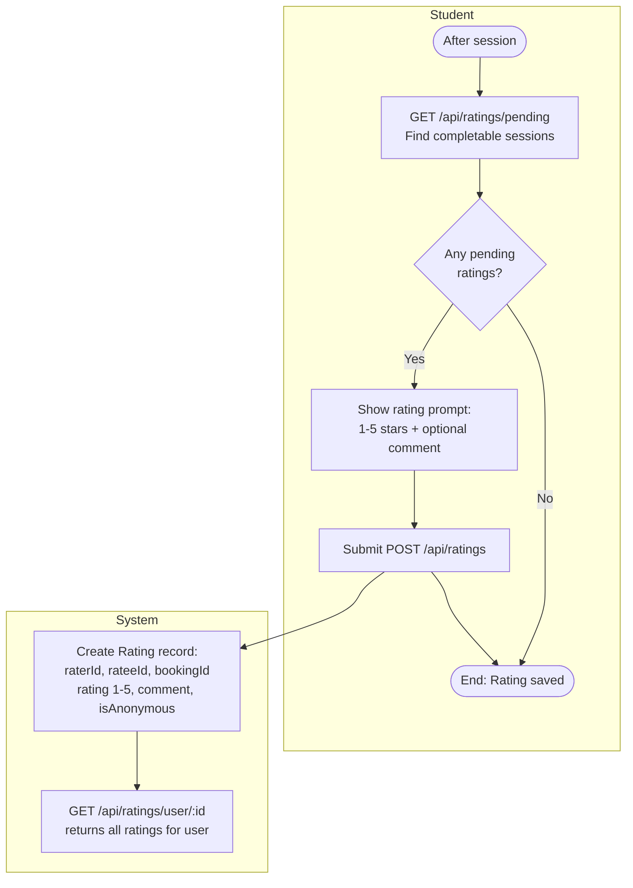
```mermaid
flowchart TD
  subgraph Student
    A([After session]) --> B[GET /api/ratings/pending\nFind completable sessions]
    B --> J1{Any pending\nratings?}
    J1 -->|No| Z([End: No action])
    J1 -->|Yes| C[Show rating prompt:\n1-5 stars + optional comment]
    C --> D[Submit POST /api/ratings]
    D --> Z([End: Rating saved])
  end

  subgraph System
    D --> SYS1[Create Rating record:\nraterId, rateeId, bookingId\nrating 1-5, comment, isAnonymous]
    SYS1 --> SYS2[GET /api/ratings/user/:id\nreturns all ratings for user]
  end
```

**Gaps in this flow:**
- ❌ No UI currently triggers the rating flow — it exists as an API but no UI component prompts for ratings
- ✅ Ratings are not linked back to analytics — Resolved 2026-06-28 (AN5: aggregateAnalytics job queries Rating table for ProfessorDailyStats.averageRating; createRating() updates StudentEngagementStats.averageRatingGiven non-blocking)
- ❌ No moderation / flagging of abusive reviews
- ❌ Professor cannot respond to a review
- ❌ Ratings are not surfaced publicly on slot cards or professor profile

---

## 8b. Session Feedback (Private)

> **What this flow does**
> After a class auto-completes, the student receives an in-app notification prompting them to share private feedback. If they haven't submitted feedback by the next login, the notification persists as an unread badge. The student can rate the session 1–5 stars and optionally fill in two text fields: "What was good?" and "What could be improved?". Feedback is visible only to the professor who taught the session and to the school admin — never to other students.
> **Who is involved:** Student, Professor/Admin, System, Worker (Cron).
> **Outcome:** Professor receives actionable private feedback; admin has a school-wide feedback dashboard.

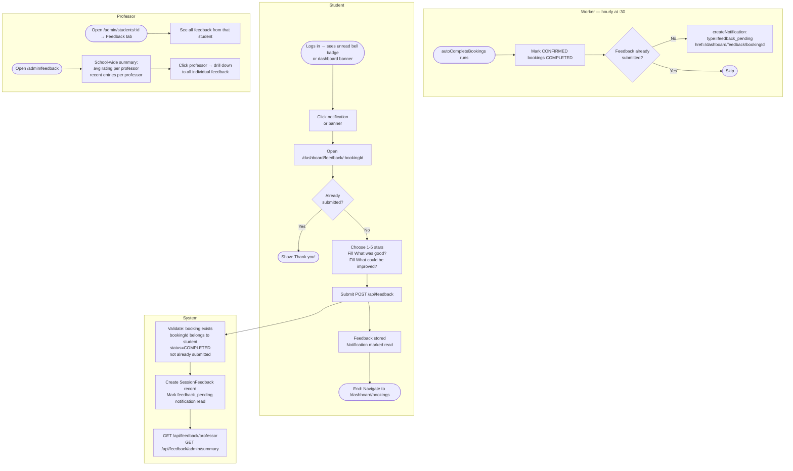
```mermaid
flowchart TD
  subgraph Worker[Worker — hourly at :30]
    W([autoCompleteBookings runs]) --> WC[Mark CONFIRMED bookings COMPLETED]
    WC --> WN{Feedback already\nsubmitted?}
    WN -->|No| NOTIF[createNotification:\ntype=feedback_pending\nhref=/dashboard/feedback/bookingId]
    WN -->|Yes| SKIP([Skip])
  end

  subgraph Student
    A([Logs in → sees unread bell badge\nor dashboard banner]) --> B[Click notification\nor banner]
    B --> C[Open /dashboard/feedback/:bookingId]
    C --> D{Already\nsubmitted?}
    D -->|Yes| DONE([Show: Thank you!])
    D -->|No| E[Choose 1-5 stars\nFill What was good?\nFill What could be improved?]
    E --> F[Submit POST /api/feedback]
    F --> G[Feedback stored\nNotification marked read]
    G --> Z([End: Navigate to /dashboard/bookings])
  end

  subgraph Professor
    P1([Open /admin/students/:id → Feedback tab]) --> P2[See all feedback from that student]
    P3([Open /admin/feedback]) --> P4[School-wide summary:\navg rating per professor\nrecent entries per professor]
    P4 --> P5[Click professor → drill down\nto all individual feedback]
  end

  subgraph System
    F --> SYS1[Validate: booking exists\nbookingId belongs to student\nstatus=COMPLETED\nnot already submitted]
    SYS1 --> SYS2[Create SessionFeedback record\nMark feedback_pending notification read]
    SYS2 --> SYS3[GET /api/feedback/professor\nGET /api/feedback/admin/summary]
  end
```

**Gaps in this flow:**
- ❌ No email notification on session completion — intentional (in-app notification only; email would be too noisy)
- ❌ No admin bulk-export of feedback (CSV)
- ❌ No response/reply feature for professor to respond to feedback

---

## 9. Referrals

> **What this flow does**
> Every user has a unique referral code they can share with friends. When a new person registers using a referral link (or enters a code manually during registration), the system automatically records who referred them. The student's referral page shows their unique link and stats. The reward fulfilment step is not implemented — referrals stay pending until future reward logic is added.
> **Who is involved:** User (referrer), New User (referred), System.
> **Outcome:** Referral automatically tracked at registration; sharing widget available on dashboard.

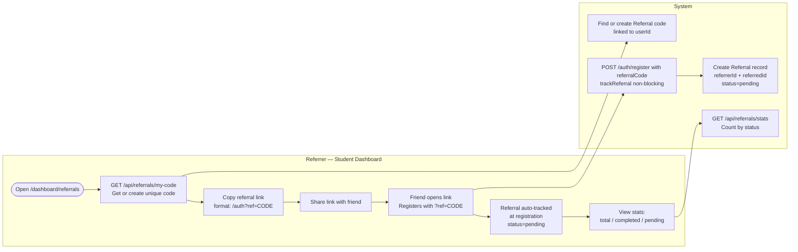
```mermaid
flowchart LR
  subgraph User[Referrer — Student Dashboard]
    A([Open /dashboard/referrals]) --> B[GET /api/referrals/my-code\nGet or create unique code]
    B --> C[Copy referral link\nformat: /auth?ref=CODE]
    C --> D[Share link with friend]
    D --> E[Friend opens link\nRegisters with ?ref=CODE]
    E --> F[Referral auto-tracked\nat registration\nstatus=pending]
    F --> G[View stats:\ntotal / completed / pending]
  end

  subgraph System
    B --> SYS1[Find or create Referral code\nlinked to userId]
    E --> SYS2[POST /auth/register with referralCode\ntrackReferral non-blocking]
    SYS2 --> SYS3[Create Referral record\nreferrerId + referredId\nstatus=pending]
    G --> SYS4[GET /api/referrals/stats\nCount by status]
  end
```

**Gaps in this flow:**
- ❌ No reward fulfillment logic — referrals stay `pending` forever (RF1 — intentional: tracking only)
- ✅ Referral code not shown in UI — Resolved 2026-06-27 (RF2: /dashboard/referrals page with ReferralLinkGenerator + stats card)
- ✅ No validation that referred user actually registers (tracking was manual POST) — Resolved 2026-06-27 (RF4: register endpoint accepts referralCode, calls trackReferral non-blocking)
- ✅ No duplicate prevention — Already resolved in trackReferral service (prevents same referrer-referred pair)

---

## 10. Notifications (In-App + Email)

> **What this flow does**
> The portal keeps users informed through two channels: emails for important events and a live in-app notification feed. The in-app feed updates in real time — the browser keeps an open SSE connection and receives new notifications as they happen. If the connection drops, the browser automatically retries with exponential backoff (up to 30 seconds). Users can click a notification to go straight to the relevant page, mark individual or all notifications as read, and load older notifications via pagination. Users can also opt out of specific notification types from their Settings page.
> **Who is involved:** Student or Professor/Admin, System.
> **Outcome:** Users are promptly informed of events; live updates reconnect automatically on drop; preferences let users silence unwanted types.

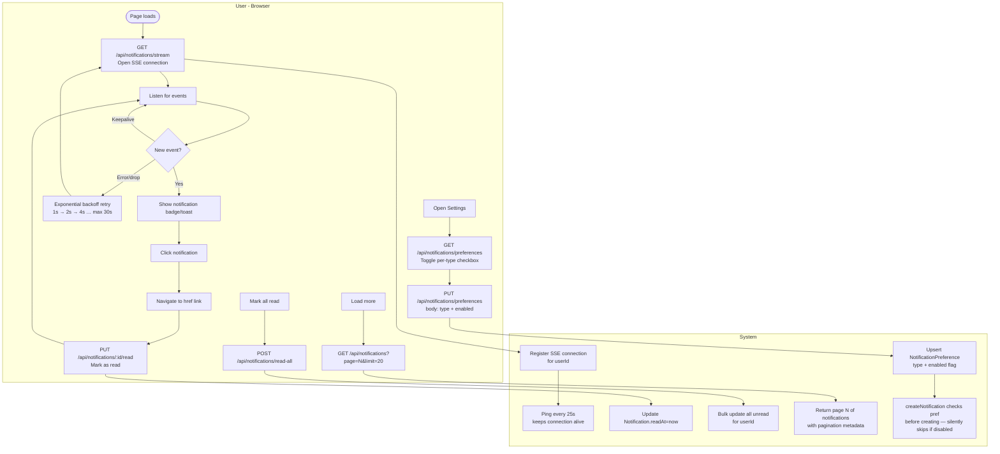
```mermaid
flowchart TD
  subgraph User_Browser[User - Browser]
    A([Page loads]) --> B[GET /api/notifications/stream\nOpen SSE connection]
    B --> LISTEN[Listen for events]
    LISTEN --> J1{New event?}
    J1 -->|Yes| C[Show notification badge/toast]
    J1 -->|Keepalive| LISTEN
    J1 -->|Error/drop| RETRY[Exponential backoff retry\n1s → 2s → 4s … max 30s]
    RETRY --> B
    C --> D[Click notification]
    D --> NAV[Navigate to href link]
    NAV --> E[PUT /api/notifications/:id/read\nMark as read]
    E --> LISTEN
    F[Mark all read] --> POST[POST /api/notifications/read-all]
    G[Load more] --> PAGINATE[GET /api/notifications?page=N&limit=20]
    H[Open Settings] --> PREFS[GET /api/notifications/preferences\nToggle per-type checkbox]
    PREFS --> PUT_PREF[PUT /api/notifications/preferences\nbody: type + enabled]
  end

  subgraph System
    B --> SYS1[Register SSE connection\nfor userId]
    SYS1 --> PING[Ping every 25s\nkeeps connection alive]
    E --> SYS2[Update Notification.readAt=now]
    POST --> SYS3[Bulk update all unread\nfor userId]
    PAGINATE --> SYS4[Return page N of notifications\nwith pagination metadata]
    PUT_PREF --> SYS5[Upsert NotificationPreference\ntype + enabled flag]
    SYS5 --> SYS6[createNotification checks pref\nbefore creating — silently skips if disabled]
  end
```

**Gaps in this flow:**
- ✅ SSE connection drops silently — no auto-reconnect logic — Resolved 2026-06-27 (N1: exponential backoff retry in useNotifications.ts; WifiOff indicator in NotificationBell when disconnected)
- ✅ No notification preferences / opt-out per type — Resolved 2026-06-27 (N2: NotificationPreference model; GET/PUT /api/notifications/preferences; Settings page preferences card; createNotification checks preference before inserting)
- ❌ No browser push notifications (Web Push API) — skipped (N3: low priority)
- ✅ Notifications not paginated — only last 30 visible — Resolved 2026-06-27 (N4: GET /notifications now accepts ?page=&limit=; useNotifications hook exposes loadMore(); NotificationBell shows "Load more" button)

---

## 11. Admin Audit & Email Logs

> **What this flow does**
> Every time a professor creates, updates or deletes something important (slots, bookings, settings), the system silently records who did it, what they did, and when. This audit trail is stored internally and helps diagnose issues. Separately, the email log page lets the professor see every email the system has sent — to whom, when, and whether it was delivered successfully or failed. This is useful for debugging cases where a student claims they never received a confirmation.
> **Who is involved:** Professor/Admin, System.
> **Outcome:** Full traceability of admin actions and email delivery history.

```mermaid
flowchart LR
  subgraph Professor
    A([Any mutating action\nPOST/PUT/DELETE on professor routes]) --> SYS1[autoAudit middleware fires]
    SYS1 --> SYS2[Create AdminAuditLog:\nactor, action, targetType,\ntargetId, payload, IP, userAgent]

    B([Open /email-logs]) --> C[GET /api/professor/email-logs\nPaginated list]
    C --> D[View email details\nstatus, content, errors]
  end
```

**Gaps in this flow:**
- ❌ No UI for viewing AdminAuditLog (only EmailLog has a UI)
- ❌ Audit logs not queryable by date range or action type in the UI
- ❌ No automated alert if email delivery fails (status=failed)

---

## 12. Background Jobs

> **What this flow does**
> Six automated tasks run in the background on the worker process, independently of any user action. They expire unconfirmed booking requests, send confirmation deadline reminders (at 6h and 24h before expiry), auto-complete past confirmed bookings, aggregate professor analytics stats daily, send class-start reminders to students (24h and 1h before each class), and clean up stale waitlist entries and old notifications. The worker also exposes a health check endpoint so Docker and monitoring tools can verify it is alive.
> **Who is involved:** Worker (Cron), Email Service, Notification Service.
> **Outcome:** The system self-maintains bookings, stats, and notifications without any manual effort, and students receive timely class reminders.

```mermaid
flowchart TD
  subgraph Worker[Worker Process — Cron + BullMQ]
    START([Worker starts]) --> HEALTH[HTTP :3001/health\nendpoint]
    START --> EMAILQ[BullMQ emailQueue worker\n3 retries exp backoff]
    START --> CRON[Register cron jobs\nnode-cron]

    CRON --> J1[Every hour :00:\nexpirePendingBookings]
    CRON --> J2[Every 2h:\nsendBookingReminders]
    CRON --> J3[Every hour :30:\nautoCompleteBookings]
    CRON --> J4[Every 30 min:\nsendClassReminders]
    CRON --> J5[Daily 01:00:\naggregateAnalytics]
    CRON --> J6[Daily 02:00:\ncleanupStaleData]

    J1 --> SYS1[Find PENDING bookings expired\nBatch → EXPIRED\nDecrement participants\nEmail + notify student]
    J2 --> SYS2[Find bookings ≤6h to expiry\nSend reminder to professor\nSecond pass: 18-26h window]
    J3 --> SYS3[Find CONFIRMED bookings\nwhere slot.endTime past\nBatch → COMPLETED\nSend feedback_pending notification\nif no feedback submitted yet]
    J4 --> SYS4[Find CONFIRMED bookings\n23-25h before start → 24h email\n45-75min before start → 1h email]
    J5 --> SYS5[For each professor:\nCompute daily stats from bookings\nUpsert ProfessorDailyStats\nUpsert ProfessorMonthlyStats]
    J6 --> SYS6[Delete WaitlistEntries\nfor past slots\nDelete read Notifications\n>30 days old]
  end

  subgraph EmailService[Email Service + BullMQ]
    SYS1 --> EM1[booking_expired_student]
    SYS2 --> EM2[confirmation_request_reminder]
    SYS4 --> EM3[class_reminder_24h\nclass_reminder_1h]
    EMAILQ --> EM4[Retry failed sends\nup to 3 attempts]
  end
```

**Gaps in this flow:**
- ✅ No job for populating ProfessorDailyStats / MonthlyStats — Resolved 2026-06-27 (J2: aggregateAnalytics runs daily at 01:00, upserts daily+monthly professor stats)
- ✅ No job for cleaning up old notifications — Resolved 2026-06-27 (J6: cleanupStaleData deletes read notifications >30 days old)
- ✅ No job for sending "upcoming class" reminders to students (24h) — Resolved 2026-06-27 (J3: sendClassReminders every 30min, 24h window with reminderSent24h guard)
- ✅ No job for sending "upcoming class" reminders to students (1h) — Resolved 2026-06-27 (J4: same sendClassReminders job, 1h window with reminderSent1h guard)
- ✅ No job for auto-completing past CONFIRMED bookings — Resolved 2026-06-27 (B10: autoCompleteBookings runs hourly at :30)
- ✅ No health/monitoring endpoint for worker process — Resolved 2026-06-27 (J7: HTTP :3001/health in worker.ts, docker-compose healthcheck updated)
- ✅ No dead letter queue or retry logic for failed emails — Resolved 2026-06-27 (J8: BullMQ emailQueue Worker in worker.ts; logEmail enqueues on failure with 3-attempt exponential backoff)
- ❌ No cleanup job for expired waitlist entries (past-date slots) — ✅ Resolved 2026-06-27 (J5: cleanupStaleData deletes WaitlistEntries for past slots)

---

## 13. GAP ANALYSIS

This section summarises all identified gaps by category. Each gap is tagged with:
- **Severity**: 🔴 Critical (breaks functionality) | 🟠 High (missing important feature) | 🟡 Medium (UX issue) | 🔵 Low (nice to have)
- **Type**: Missing validation | Missing email | Missing notification | Missing UI | Missing logic | Security concern

---

### Authentication & Security

| # | Gap | Severity | Type |
|---|-----|----------|------|
| A1 | ✅ No "password changed" confirmation email after successful reset — Resolved 2026-06-27 | 🟠 High | Missing email |
| A2 | ✅ Active JWT cookies not invalidated on password change — Resolved 2026-06-27 (tokenVersion on User; increment on pw change; middleware rejects stale tokens) | 🔴 Critical | Security concern |
| A3 | ✅ Logout only clears cookie — no server-side token blacklist — Resolved 2026-06-27 (POST /auth/logout-all increments tokenVersion) | 🟠 High | Security concern |
| A4 | Only admins can enable 2FA — intentional product decision, not a gap | 🟡 Medium | Missing feature |
| A5 | ✅ Recovery codes cannot be regenerated after exhaustion — Resolved 2026-06-27 (POST /auth/2fa/regen-recovery with TOTP verification) | 🔴 Critical | Missing logic |
| A6 | ✅ Multiple password reset tokens not invalidated on new request — Already resolved (createPasswordResetToken calls deleteMany) | 🟡 Medium | Security concern |
| A7 | ✅ No "login from new IP" email alert for admin accounts — Resolved 2026-06-27 (knownIps field, sendNewIpAlertEmail on new IP for admins) | 🟡 Medium | Missing email |
| A8 | ✅ No password strength meter / inline complexity rules shown to user — Resolved 2026-06-27 (PasswordStrengthMeter component on RegisterPage + Settings) | 🟡 Medium | Missing UI |
| A9 | ✅ No email address change flow — Resolved 2026-06-27 (POST /auth/change-email + GET /auth/verify-email-change + VerifyEmailChangePage + Settings card) | 🟠 High | Missing use case |
| A10 | ✅ No account deletion flow — Resolved 2026-06-27 (POST /auth/delete-account soft delete; deletedAt + tokenVersion; Settings Danger Zone + DeleteAccountDialog) | 🟡 Medium | Missing use case |
| A11 | ✅ No "Welcome" onboarding email after email verification — Resolved 2026-06-27 (sendWelcomeEmail fires on first isEmailVerified=true) | 🔵 Low | Missing email |
| A12 | ✅ Timezone not auto-detected on registration — Already resolved (RegisterPage defaultValues use Intl.DateTimeFormat) | 🔵 Low | Missing UI |
| A13 | ✅ Brute-force lockout (rate limit) not surfaced clearly in UI — Resolved 2026-06-27 (429 interceptor in api.ts; rateLimitMessage with Retry-After shown as toast) | 🟡 Medium | Missing UI |

---

### Booking Lifecycle

| # | Gap | Severity | Type |
|---|-----|----------|------|
| B1 | ✅ Student receives NO notification when booking expires (48h timeout) — Resolved 2026-06-27 (sendBookingExpiredToStudent email + in-app notification) | 🔴 Critical | Missing email + notification |
| B2 | ✅ Professor receives NO notification when booking expires — Resolved 2026-06-27 (in-app `booking_expired_professor` notification created by expiry job) | 🟠 High | Missing notification |
| B3 | ✅ Slot `currentParticipants` not decremented when booking EXPIRES or is REJECTED — Resolved 2026-06-27 (applyRejectionSideEffects service + expirePendingBookings rewrite) | 🔴 Critical | Missing logic (data integrity) |
| B4 | ✅ Only one professor reminder sent; no second at e.g. 24h — Resolved 2026-06-27 (secondReminderSentAt field; second pass in sendBookingReminders at 18–26h before expiry) | 🟡 Medium | Missing logic |
| B5 | ✅ No re-booking path for a student after their booking was REJECTED or EXPIRED — Resolved 2026-06-27 ("Book Another Slot" button shown for REJECTED/EXPIRED bookings in BookingsPage) | 🟠 High | Missing UX |
| B6 | ✅ Booking confirmation window (48h) not shown as countdown to student — Resolved 2026-06-27 (amber countdown badge on PENDING_CONFIRMATION bookings in BookingsPage) | 🟡 Medium | Missing UI |
| B7 | Professor cannot add a message when confirming (only when rejecting) — intentional product decision, not a gap | 🟡 Medium | Missing feature |
| B8 | Professor cannot propose a reschedule instead of reject — too complex, skipped | 🔵 Low | Missing use case |
| B9 | ✅ No student-visible indication of how many spots remain in GROUP slots — Resolved 2026-06-27 (spots_filled badge shown for GROUP slot bookings in BookingsPage) | 🟡 Medium | Missing UI |
| B10 | ✅ CONFIRMED bookings never transition to COMPLETED status — Resolved 2026-06-27 (autoCompleteBookings job runs hourly at :30, auto-completes past CONFIRMED bookings) | 🔴 Critical | Missing logic |
| B11 | ✅ Student cannot provide a reason when cancelling — Already implemented | 🔵 Low | Missing UX |

---

### Slot Management

| # | Gap | Severity | Type |
|---|-----|----------|------|
| S1 | Bulk-created overlapping slots silently skipped — no report shown | 🟡 Medium | Missing validation feedback |
| S2 | No way to edit all slots in a recurring pattern at once | 🟠 High | Missing feature |
| S3 | No delete-entire-recurring-pattern action | 🟠 High | Missing use case |
| S4 | No minimum/maximum slot duration validation | 🟡 Medium | Missing validation |
| S5 | Timezone display: students and professor may be in different TZs — times not clearly shown in student's timezone on slot cards | 🔴 Critical | Missing UI / data display |
| S6 | No notification to student when a direct booking is made by professor (if sendInvitation=false) | 🟠 High | Missing notification |
| S7 | Professor direct booking creates no in-app notification for student | 🟠 High | Missing notification |

---

### Waitlist

| # | Gap | Severity | Type |
|---|-----|----------|------|
| W1 | After waitlist promotion is rejected by professor, student NOT re-added to waitlist | 🟠 High | Missing logic |
| W2 | Waitlist entries not cleaned up when slot is CANCELLED | 🔴 Critical | Missing logic (data integrity) |
| W3 | Waitlist entries not cleaned up for past-date slots | 🟡 Medium | Missing cleanup job |
| W4 | No waitlist position update notifications when users ahead leave | 🔵 Low | Missing notification |
| W5 | Waitlist only for GROUP slots — not documented in UI | 🟡 Medium | Missing UX clarity |

---

### Meetings & Video

| # | Gap | Severity | Type |
|---|-----|----------|------|
| M1 | No time-gate on meeting join (student can join days early/late) | 🟡 Medium | Missing validation |
| M2 | MeetingNote model exists but has no UI | 🟠 High | Missing UI |
| M3 | No post-class rating prompt after meeting | 🟠 High | Missing UX |
| M4 | No recording management | 🔵 Low | Missing feature |

---

### Analytics & Stats

| # | Gap | Severity | Type |
|---|-----|----------|------|
| AN1 | ✅ ProfessorDailyStats / MonthlyStats have no population mechanism — Resolved 2026-06-27 (J2: aggregateAnalytics job, daily at 01:00, computes from Booking + Rating tables; upserts both tables) | 🔴 Critical | Missing logic |
| AN2 | ✅ StudentEngagementStats never updated on booking lifecycle — Resolved 2026-06-28 (incrementEngagementStat called in bookSlot/cancelBooking/autoCompleteBookings; updateAverageRatingGiven called after createRating) | 🔴 Critical | Missing logic |
| AN3 | ✅ PlatformDailyStats never populated — Resolved 2026-06-28 (aggregatePlatformStats added to aggregateAnalytics job: totalBookings, completedBookings, cancelledBookings, activeStudents, activeProfessors, newRegistrations, totalRevenueRSD) | 🔴 Critical | Missing logic |
| AN4 | ✅ No earnings export (CSV/PDF) — Resolved 2026-06-28 (GET /api/analytics/professor/export returns CSV with date range; Export CSV button + date picker in ProfessorAnalyticsDashboard) | 🟡 Medium | Missing feature |
| AN5 | ✅ Rating/review data not flowing into analytics aggregates — Resolved 2026-06-28 (aggregateAnalytics queries Rating table for averageRating in daily/monthly stats; createRating updates StudentEngagementStats.averageRatingGiven) | 🟠 High | Missing logic |

---

### Ratings & Reviews

| # | Gap | Severity | Type |
|---|-----|----------|------|
| R1 | No UI triggers the ratings flow — API exists but no frontend component | 🔴 Critical | Missing UI |
| R2 | Professor cannot respond to a review | 🔵 Low | Missing feature |
| R3 | Ratings not surfaced on slot cards or student-visible professor profile | 🟠 High | Missing UI |
| R4 | No review moderation / flagging | 🔵 Low | Missing feature |

---

### Referrals

| # | Gap | Severity | Type |
|---|-----|----------|------|
| RF1 | No reward fulfilment logic — referrals stay `pending` forever — intentional, tracking only | 🔴 Critical | Missing logic |
| RF2 | ✅ No referral UI (sharing widget, my referrals page) — Resolved 2026-06-27 (/dashboard/referrals page with ReferralLinkGenerator + stats) | 🔴 Critical | Missing UI |
| RF3 | ✅ No duplicate referral prevention — Already resolved in trackReferral service | 🟠 High | Missing validation |
| RF4 | ✅ Referral not tied to registration flow (manual POST required) — Resolved 2026-06-27 (register accepts referralCode + inviteToken, auto-tracks) | 🟠 High | Missing integration |

---

### Professor–Student Assignment (new in v5)

| # | Gap | Severity | Type |
|---|-----|----------|------|
| PS1 | Professor dashboard shows ALL students instead of only assigned ones — Resolved 2026-06-27 (GET /professor/students now filters by ProfessorStudent.professorId) | 🔴 Critical | Data integrity |
| PS2 | Student slot browser shows ALL professors' slots — Resolved 2026-06-27 (GET /student/slots scoped to assigned professor + active cover professors) | 🔴 Critical | UX / data scope |
| PS3 | No professor–student assignment model — Resolved 2026-06-27 (ProfessorStudent + StudentCover + StudentInvitation tables added) | 🔴 Critical | Missing model |
| PS4 | Professor cannot invite unregistered students — Resolved 2026-06-27 (POST /professor/invite-student + sendStudentInvitationEmail + GET /auth/accept-invitation redirect) | 🟠 High | Missing feature |
| PS5 | Unassigned students have no way to choose a professor — Resolved 2026-06-27 (/dashboard/choose-professor page + POST /student/select-professor) | 🟠 High | Missing UX |
| PS6 | No cover/substitute professor support during vacations — Resolved 2026-06-27 (StudentCover model + POST /professor/covers + students see cover professor slots) | 🟠 High | Missing feature |

---

### Notifications

| # | Gap | Severity | Type |
|---|-----|----------|------|
| N1 | ✅ SSE connection drops — no auto-reconnect in frontend — Resolved 2026-06-27 (exponential backoff retry 1s→30s in useNotifications.ts; WifiOff indicator in NotificationBell) | 🟠 High | Missing resilience |
| N2 | ✅ No notification preferences / opt-out per type — Resolved 2026-06-27 (NotificationPreference DB table; GET/PUT /api/notifications/preferences; Settings page card; createNotification checks before inserting) | 🟡 Medium | Missing feature |
| N3 | No browser push notifications (Web Push API) — skipped, low priority | 🔵 Low | Missing feature |
| N4 | ✅ Notifications not paginated — only last 30 visible — Resolved 2026-06-27 (?page=&limit= on GET /notifications; loadMore() in hook; "Load more" button in NotificationBell) | 🔵 Low | Missing feature |

---

### Background Jobs & Operations

| # | Gap | Severity | Type |
|---|-----|----------|------|
| J1 | ✅ No job to auto-complete past CONFIRMED bookings → COMPLETED — Resolved 2026-06-27 (autoCompleteBookings, hourly at :30) | 🔴 Critical | Missing job |
| J2 | ✅ No job to populate analytics stats tables — Resolved 2026-06-27 (aggregateAnalytics, daily at 01:00, professor daily+monthly stats) | 🔴 Critical | Missing job |
| J3 | ✅ No "class starts in 24h" reminder email to students — Resolved 2026-06-27 (sendClassReminders every 30min, reminderSent24h guard) | 🟠 High | Missing job + email |
| J4 | ✅ No "class starts in 1h" reminder email/notification — Resolved 2026-06-27 (same sendClassReminders job, reminderSent1h guard) | 🟠 High | Missing job + email |
| J5 | ✅ No cleanup job for expired waitlist entries (past-date slots) — Resolved 2026-06-27 (cleanupStaleData daily at 02:00) | 🟡 Medium | Missing job |
| J6 | ✅ No cleanup job for old notifications — Resolved 2026-06-27 (cleanupStaleData deletes read notifications >30 days) | 🔵 Low | Missing job |
| J7 | ✅ No worker health check / monitoring endpoint — Resolved 2026-06-27 (HTTP :3001/health in worker.ts, docker-compose healthcheck updated) | 🟠 High | Missing operations |
| J8 | ✅ No dead-letter queue or retry logic for failed email delivery — Resolved 2026-06-27 (BullMQ emailQueue Worker with 3-attempt exponential backoff; logEmail enqueues on failure) | 🟠 High | Missing resilience |

---

### Session Feedback (new in v8)

| # | Gap | Severity | Type |
|---|-----|----------|------|
| SF1 | ✅ No private session feedback mechanism — Resolved 2026-06-28 (SessionFeedback model; POST /api/feedback; /dashboard/feedback/:bookingId page; feedback_pending in-app notification on session completion) | 🟠 High | Missing feature |
| SF2 | ✅ No school-owner view of feedback across all professors — Resolved 2026-06-28 (GET /api/feedback/admin/summary; /admin/feedback FeedbackDashboard page with per-professor cards and drill-down) | 🟠 High | Missing feature |
| SF3 | No email reminder when feedback notification is ignored (only in-app) — intentional design decision | 🔵 Low | Missing notification |
| SF4 | No admin CSV export of all feedback | 🔵 Low | Missing feature |
| SF5 | Professor cannot respond to student feedback | 🔵 Low | Missing feature |

---

### Priority Summary

| Severity | Count | Top Items |
|----------|-------|-----------|
| 🔴 Critical | 1 | R1 (no rating UI) |
| 🟠 High | 4 | S2-S3 (pattern management), M2 (meeting notes UI), M3 (post-class rating prompt) |
| 🟡 Medium | 6 | S5 (timezone display), M1 (meeting time-gate) |
| 🔵 Low | 9 | B8, M4, N3, SF3-SF5 |
| ✅ Resolved (Auth) | 11 | A1–A3, A5–A13 |
| ✅ Resolved (Booking) | 9 | B1–B6, B9–B11 |
| ✅ Resolved (Jobs) | 8 | J1–J8 |
| ✅ Resolved (Analytics) | 5 | AN1–AN5 |
| ✅ Resolved (Referrals+Assignment) | 9 | RF2–RF4, PS1–PS6 |
| ✅ Resolved (Notifications) | 3 | N1, N2, N4 |
| ✅ Resolved (Session Feedback) | 2 | SF1, SF2 |
| **Total open** | **20** | |
| ✅ Resolved (Referrals+Assignment) | 9 | RF2–RF4, PS1–PS6 |
| ✅ Resolved (Notifications) | 3 | N1, N2, N4 |
| ✅ Resolved (Analytics) | 5 | AN1–AN5 |
| **Total open** | **15** | |
