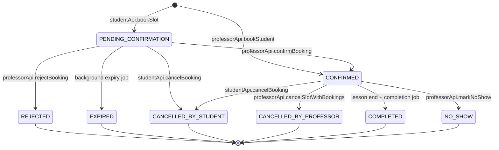

# Booking status transition map

## Enum sources

Both enums live in [packages/shared/src/types.ts](../../../packages/shared/src/types.ts) and are imported by frontend and backend without re-declaration.

### `BookingStatus` — [types.ts:94-103](../../../packages/shared/src/types.ts#L94-L103)

| Value | Meaning |
|---|---|
| `PENDING_CONFIRMATION` | Student has requested; professor has not yet acted. Slot reserved until expiry. |
| `CONFIRMED` | Professor approved (or professor-initiated booking). |
| `REJECTED` | Professor rejected, with reason. |
| `EXPIRED` | Confirmation window passed without action. |
| `CANCELLED_BY_STUDENT` | Student cancelled (before or after confirmation). |
| `CANCELLED_BY_PROFESSOR` | Professor cancelled (with reason). |
| `COMPLETED` | Lesson took place. |
| `NO_SHOW` | Lesson time passed without the lesson taking place. |

### `SlotStatus` — [types.ts:36-42](../../../packages/shared/src/types.ts#L36-L42)

| Value | Meaning |
|---|---|
| `AVAILABLE` | Open for booking. |
| `FULLY_BOOKED` | Capacity reached. |
| `IN_PROGRESS` | Lesson is happening now. |
| `COMPLETED` | Slot's lesson is done. |
| `CANCELLED` | Professor cancelled the slot. |

## Transition diagram

## Lifecycle commentary

- **Origin asymmetry.** Student bookings start in `PENDING_CONFIRMATION`. Professor-created bookings via `professorApi.bookStudent` go straight to `CONFIRMED`. Both flows must be preserved. See [packages/frontend/CLAUDE.md](../../../packages/frontend/CLAUDE.md): "A professor-created booking is immediately confirmed."
- **Two cancellation roles.** Source of cancellation is encoded in status (`CANCELLED_BY_STUDENT` vs `CANCELLED_BY_PROFESSOR`). The display layer must show this distinction.
- **Expiry is server-driven.** A background job moves stale `PENDING_CONFIRMATION` bookings to `EXPIRED`. The expiry window length is configured server-side; the UI should explain it in the student-facing copy.
- **Approval HTTP route vs SDK verb.** The HTTP route is `POST /professor/bookings/{id}/approve`; the frontend SDK method is `professorApi.confirmBooking`; the resulting status is the confirmed state. The UI verb is "approve" (consistent with [docs/product/processes-overview.md](../../product/processes-overview.md)).
- **Rejection reason is required.** `professorApi.rejectBooking(bookingId, reason)` requires a reason string.
- **`NO_SHOW`** is a status separate from `COMPLETED` — both are terminal post-lesson states. The status is set explicitly via `markNoShow`.

## Current rendering

[components/booking/BookingStatusBadge.tsx](../../../packages/frontend/src/components/booking/BookingStatusBadge.tsx) is the only centralized renderer. It maps statuses to:

| `BookingStatus` | Hardcoded label | Color (legacy Tailwind) | Icon |
|---|---|---|---|
| `CONFIRMED` | "Confirmed" | `edu-emerald-100` bg | `CheckCircle` |
| `PENDING_CONFIRMATION` | "Pending" | `amber-50` bg | — |
| `REJECTED` | "Rejected" | `red-100` bg | `XCircle` |
| `EXPIRED` | "Expired" | `gray-100` bg | `AlertCircle` |
| `CANCELLED_BY_STUDENT` | "Cancelled" | `gray-100` bg | — |
| `CANCELLED_BY_PROFESSOR` | "Cancelled" | `gray-100` bg | — |
| `COMPLETED` | "Completed" | `edu-blue-100` bg | — |
| `NO_SHOW` | "No Show" | `edu-orange-100` bg | `AlertCircle` |

**Two issues** for Phase 1+ to resolve:

1. Labels are not localized. Serbian and Spanish users see English status text.
2. Colors come from legacy `edu-*` palette in [tailwind.config.js](../../../packages/frontend/tailwind.config.js). The Editorial Teaching Studio system in [docs/ui-system/design-tokens.json](../../ui-system/design-tokens.json) defines semantic equivalents (`available`, `requested`, `confirmed`, `blocked`, `completed`, `cancelled`).

## Mapping to Editorial Teaching Studio statuses

The UI system uses six semantic status tones. Mapping the eight backend states onto them:

| Backend `BookingStatus` | UI semantic |
|---|---|
| `PENDING_CONFIRMATION` | `requested` (amber/orange) |
| `CONFIRMED` | `confirmed` (teal) |
| `REJECTED` | `cancelled` (red) |
| `EXPIRED` | `blocked` / `cancelled` — Phase 1 decision in ADR |
| `CANCELLED_BY_STUDENT` | `cancelled` |
| `CANCELLED_BY_PROFESSOR` | `cancelled` (with role-aware copy) |
| `COMPLETED` | `completed` |
| `NO_SHOW` | `cancelled` or `blocked` — Phase 1 decision in ADR |

`SlotStatus.AVAILABLE` maps to UI `available`; `SlotStatus.CANCELLED` maps to UI `cancelled`; `SlotStatus.IN_PROGRESS` maps to UI `confirmed` (live). These mappings are documented here so the Phase 1 `lib/ui-system/status.ts` module has a single source.

## SlotStatus rendering

No badge exists today. Slot status is inferred from booking count or implicit context in:

- [pages/admin/SlotsPage.tsx](../../../packages/frontend/src/pages/admin/SlotsPage.tsx)
- [pages/admin/CalendarPage.tsx](../../../packages/frontend/src/pages/admin/CalendarPage.tsx)
- [pages/student/BookPage.tsx](../../../packages/frontend/src/pages/student/BookPage.tsx)

Phase 1+ produces a centralized `SlotStatusBadge` and migrates these pages to it.

## Centralization contract for Phase 1

Per [.claude/rules/frontend/architecture.md](../../../.claude/rules/frontend/architecture.md): "Centralize booking-state labels, icons, tones, and allowed actions." The Phase 1 deliverable `packages/frontend/src/lib/ui-system/status.ts` owns this central mapping for both `BookingStatus` and `SlotStatus`, references i18n keys under `booking.status.*` and `slot.status.*`, and is the only module that may render a status label or color decision.
